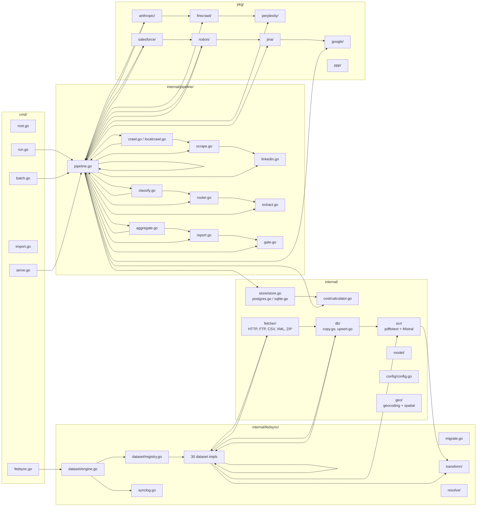
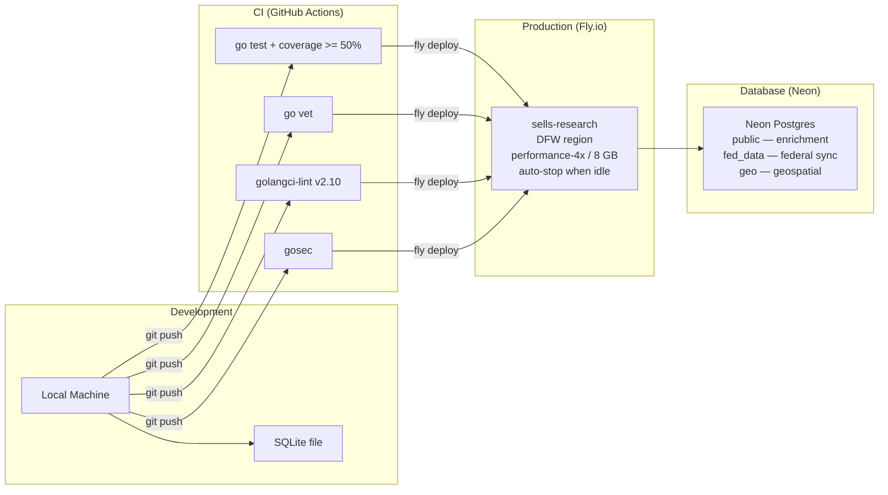

# System Architecture

> Reference documentation for research-cli's architecture, external services, and deployment topology.

## System Context

```mermaid
graph TB
    subgraph Triggers
        CSV[CSV Import]
        Cron[Fly.io Cron]
        Webhook[Webhook /run]
    end

    subgraph "research-cli"
        Pipeline[Enrichment Pipeline]
        Fedsync[Fedsync Engine]
    end

    subgraph "LLM Services"
        Anthropic[Anthropic API<br/>Haiku / Sonnet / Opus]
        Perplexity[Perplexity API<br/>sonar-pro]
    end

    subgraph "Crawl & Search"
        Firecrawl[Firecrawl v2]
        Jina[Jina Reader + Search]
        Google[Google Places + Geocoding]
    end

    subgraph "Destinations"
        SF[Salesforce REST API]
        Notion[Notion API]
        ToolJet[ToolJet Webhook]
    end

    subgraph "Data Stores"
        Neon["Neon Postgres<br/>public / fed_data / geo"]
        SQLite["SQLite (dev only)"]
    end

    subgraph "Federal Data Sources"
        Census[Census Bureau<br/>CBP, SUSB, ABS, NES, ASM, M3]
        BLS[BLS<br/>QCEW, OEWS, ECI, LAUS]
        SEC[SEC EDGAR<br/>ADV, 13F, Form D, XBRL]
        SAM[SAM.gov<br/>FPDS contracts]
        FINRA[FINRA<br/>BrokerCheck]
        SBA[SBA<br/>PPP loans]
        OSHA[OSHA ITA]
        EPA[EPA ECHO]
        FRED[FRED<br/>Economic series]
    end

    CSV --> Pipeline
    Cron --> Fedsync
    Webhook --> Pipeline

    Pipeline --> Anthropic
    Pipeline --> Perplexity
    Pipeline --> Firecrawl
    Pipeline --> Jina
    Pipeline --> Google
    Pipeline --> SF
    Pipeline --> Notion
    Pipeline --> ToolJet
    Pipeline --> Neon

    Fedsync --> Neon
    Fedsync --> Census
    Fedsync --> BLS
    Fedsync --> SEC
    Fedsync --> SAM
    Fedsync --> FINRA
    Fedsync --> SBA
    Fedsync --> OSHA
    Fedsync --> EPA
    Fedsync --> FRED
```

## Component Diagram

## Deployment

## External Services

| Service | Purpose | Package | Auth Method | Rate Limit |
|---|---|---|---|---|
| Anthropic (Haiku) | T1 extraction, classification, LinkedIn parse | `pkg/anthropic` | API key | Per-model RPM |
| Anthropic (Sonnet) | T2 multi-page synthesis | `pkg/anthropic` | API key | Per-model RPM |
| Anthropic (Opus) | T3 deep analysis | `pkg/anthropic` | API key | Per-model RPM |
| Firecrawl v2 | Fallback crawl + async scrape | `pkg/firecrawl` | API key | 3,000 credits/mo |
| Perplexity | LinkedIn search (sonar-pro) | `pkg/perplexity` | API key | Per-plan RPM |
| Jina | Web reader + search | `pkg/jina` | API key | — |
| Google Places | Business search + validation | `pkg/google` | API key | — |
| Google Geocoding | Address geocoding | `pkg/geocode` | API key | — |
| Salesforce | Account write (JWT auth) | `pkg/salesforce` | JWT private key | Bulk API limits |
| Notion | Lead tracker, question/field registries | `pkg/notion` | Integration token | 3 req/s |
| SEC EDGAR | ADV, 13F, Form D, XBRL, submissions | `internal/fetcher` | User-Agent header | 10 req/s |
| SAM.gov | FPDS contract data | `internal/fetcher` | API key | 5 req/s |
| Census Bureau | CBP, SUSB, ABS, NES, ASM, M3, EconCensus | `internal/fetcher` | API key | 20 req/s |
| BLS | QCEW, OEWS, ECI, LAUS | `internal/fetcher` | API key | 20 req/s |
| FRED | Economic time series | `internal/fetcher` | API key | 20 req/s |

## Data Stores

| Store | Technology | Schema | Purpose |
|---|---|---|---|
| Neon Postgres | pgx driver | `public` | Enrichment runs, answers, field values, provenance |
| Neon Postgres | pgx driver | `fed_data` | 30 federal dataset tables + sync log + migrations |
| Neon Postgres | pgx driver | `geo` | Geocoded locations, spatial indexes, MVT tiles |
| SQLite | modernc.org/sqlite (no CGO) | — | Local development (implements same `Store` interface) |
| Notion | REST API | — | Lead queue, question registry, field registry |
| Salesforce | REST API | — | Final destination for enriched account data |

## Related Docs

- [Pipeline Data Flow](data-flow.md) — phase-by-phase enrichment detail
- [Fedsync Dataset Catalog](fedsync-catalog.md) — all 30 federal datasets
- [API Cost Model](cost-model.md) — pricing, optimization strategies, config knobs
- [Operational Runbook](runbook.md) — deployment, monitoring, troubleshooting
