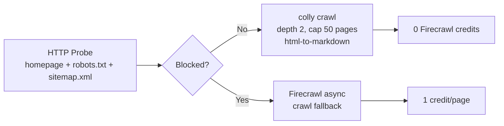
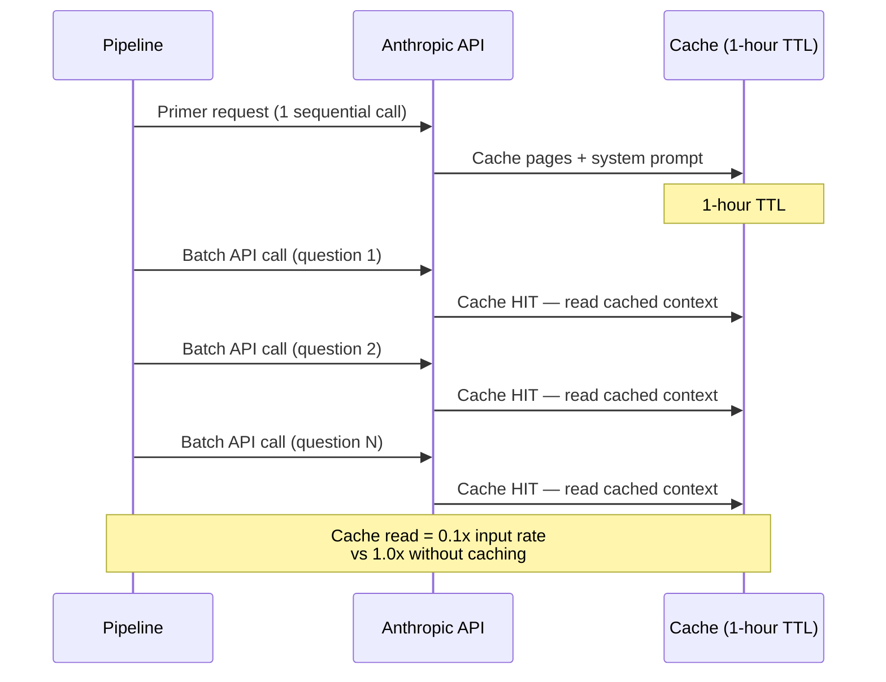
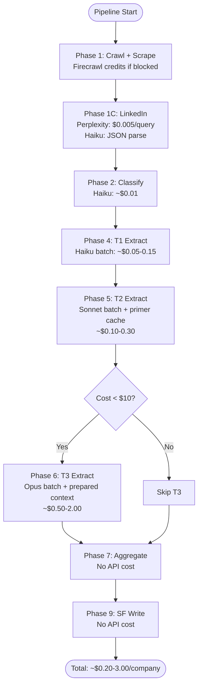

# API Cost Model

> Pricing reference, optimization strategies, and config knobs for controlling API costs.
>
> For per-company cost breakdowns and benchmarks, see the [Cost Analysis section in README.md](../README.md#cost-analysis).

## Pricing Reference

Rates from `internal/cost/calculator.go` `DefaultRates()` and `config.example.yaml`:

### Claude Models

| Model | Input ($/MTok) | Output ($/MTok) | Batch Discount | Cache Write | Cache Read |
|---|---|---|---|---|---|
| Haiku (`claude-haiku-4-5-20251001`) | $0.80 | $4.00 | 50% | 1.25x input | 0.1x input |
| Sonnet (`claude-sonnet-4-5-20250929`) | $3.00 | $15.00 | 50% | 1.25x input | 0.1x input |
| Opus (`claude-opus-4-6`) | $15.00 | $75.00 | 50% | 1.25x input | 0.1x input |

### Other Providers

| Provider | Metric | Rate |
|---|---|---|
| Jina Reader | Per million tokens | $0.02 |
| Perplexity | Per query (sonar-pro) | $0.005 |
| Firecrawl | Monthly plan | $19.00 (3,000 credits included) |
| Google Places | Per text search | $0.032 |
| Google Geocoding | Per request | $0.005 |

### Cost Calculation

The `Calculator` in `internal/cost/calculator.go` computes per-call costs:

```
Claude cost = (input_tokens/1M * input_rate * batch_mul)
            + (output_tokens/1M * output_rate * batch_mul)
            + (cache_write_tokens/1M * input_rate * cache_write_mul * batch_mul)
            + (cache_read_tokens/1M * input_rate * cache_read_mul * batch_mul)

where batch_mul = 0.5 if Batch API, else 1.0
```

## Optimization Strategies

### 1. Local-First Crawl (~55% Firecrawl Credit Reduction)

The pipeline probes each site with `net/http` before falling back to Firecrawl:



~60% of sites serve clean HTML, resulting in ~55% Firecrawl credit savings.

Implementation: `internal/pipeline/localcrawl.go`, `internal/pipeline/blockdetect.go`

### 2. Tiered Model Selection

Questions are routed to the cheapest capable model:

| Tier | Model | ~Question Count | Cost Profile |
|---|---|---|---|
| T1 | Haiku | ~70 | Cheapest: single-page fact extraction |
| T2 | Sonnet | ~25 | Mid-tier: multi-page synthesis |
| T3 | Opus | ~5 | Most expensive: deep analysis |

T3 is gated by `pipeline.tier3_gate` (default: `"off"`) and a per-company cost budget.

### 3. Primer + Batch Caching (~42% Claude Cost Savings)

For T2/T3 extraction, the pipeline uses a two-step caching strategy:



- Primer warms the cache with a single sequential request
- Batch API calls hit the warm cache at 0.1x input rate
- Combined with Batch API's 50% discount: `0.5 * 0.1 = 0.05x` effective input rate for cached tokens

Implementation: `pkg/anthropic/cache.go`

### 4. T3 Context Preparation (~87% Cheaper vs Raw Crawl)

Instead of sending raw crawl data (~150K tokens) to Opus, the pipeline uses Haiku to prepare a condensed context (~25K tokens):

| Approach | Input Tokens | Opus Input Cost |
|---|---|---|
| Raw crawl pages | ~150,000 | ~$2.25 |
| Haiku-prepared context | ~25,000 | ~$0.375 |
| **Savings** | **83% fewer tokens** | **~$1.875/company** |

The Haiku summarization itself costs ~$0.02 (negligible), for net ~87% savings on T3.

### 5. Batch API (50% Discount)

All extraction questions are submitted via the Anthropic Batch API, which provides a flat 50% discount on both input and output tokens. Batches are polled with exponential backoff.

Implementation: `pkg/anthropic/batch.go`

### 6. Answer Caching / Skip

High-confidence answers from prior runs are reused, skipping re-extraction:

- Threshold: `pipeline.skip_confidence_threshold` (default: 0.8)
- TTL: `pipeline.answer_reuse_ttl_days` (default: unlimited)
- ADV pre-fill: Answers from `fed_data` tables bypass LLM extraction entirely

### 7. Per-Company Cost Budget

A hard cap prevents runaway costs on any single company:

- Config: `pipeline.max_cost_per_company_usd` (default: $10.00)
- When cumulative cost exceeds the budget, T3 extraction is skipped
- Phases 1-5 are not subject to the budget (T1/T2 costs are modest)

## Per-Company Cost Flow



## Config Knobs

All cost-related configuration in `config.example.yaml`:

| Config Key | Default | Effect |
|---|---|---|
| `pipeline.confidence_escalation_threshold` | `0.4` | T1 answers below this confidence escalate to T2 |
| `pipeline.tier3_gate` | `"off"` | T3 execution: `"off"`, `"ambiguity_only"`, `"always"` |
| `pipeline.quality_score_threshold` | `0.6` | Minimum quality score for SF write |
| `pipeline.max_cost_per_company_usd` | `10.0` | Per-company cost budget (skips T3 if exceeded) |
| `pipeline.skip_confidence_threshold` | `0.8` | Reuse answers above this confidence from prior runs |
| `pipeline.answer_reuse_ttl_days` | unlimited | Max age for reused answers |
| `anthropic.max_batch_size` | `100` | Max questions per Batch API call |
| `firecrawl.max_pages` | `50` | Max pages per Firecrawl crawl |
| `crawl.max_pages` | `50` | Max pages for local colly crawl |
| `crawl.max_depth` | `2` | Link-following depth for local crawl |
| `batch.max_concurrent_companies` | `5` | Parallel companies in batch mode |
| `pricing.anthropic.*` | See [Pricing Reference](#pricing-reference) | Override default model pricing |
| `pricing.jina.per_mtok` | `0.02` | Jina Reader rate per million tokens |
| `pricing.perplexity.per_query` | `0.005` | Perplexity rate per query |
| `pricing.firecrawl.plan_monthly` | `19.00` | Firecrawl monthly plan cost |
| `pricing.firecrawl.credits_included` | `3000` | Credits included in plan |

## Related Docs

- [System Architecture](architecture.md) — external services overview
- [Pipeline Data Flow](data-flow.md) — where costs are incurred in each phase
- [Operational Runbook](runbook.md) — monitoring costs in production
