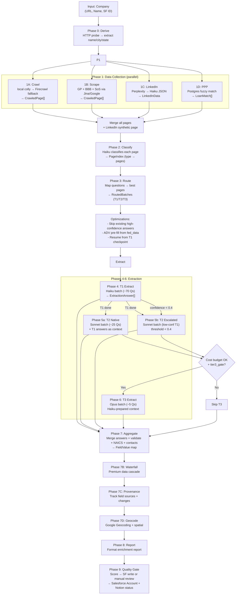
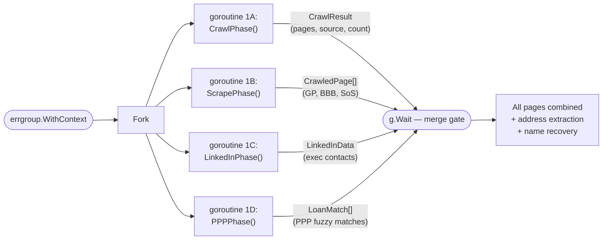
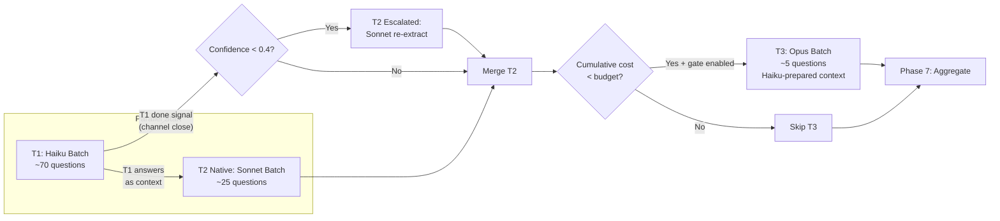
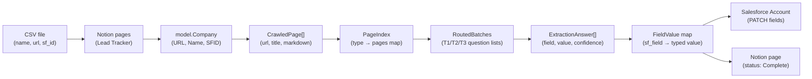

# Pipeline Data Flow

> Phase-by-phase reference for the enrichment pipeline, covering data shapes, decision points, and external service interactions.
>
> For architecture context, see [System Architecture](architecture.md).

## Full Pipeline Flowchart

## Phase 1: Parallel Data Collection

Four goroutines fan out via `errgroup`, collecting data from independent sources:

**Conditional execution:**
- **1A (Crawl):** Always runs
- **1B (Scrape):** Requires company name; skipped in sourcing mode
- **1C (LinkedIn):** Requires company name
- **1D (PPP):** Requires company name + location

**Error handling:** Individual phase failures don't abort the pipeline. If all data-producing phases (1A/1B/1C) fail, the pipeline aborts with a categorized error.

## Phase Details

### Phase 0: Derive Company Info

| | |
|---|---|
| **Input** | Company with URL only (no name) |
| **Output** | Derived name, city, state |
| **Services** | None (HTTP probe only) |
| **Files** | `pipeline.go`, `localcrawl.go` |
| **Decision** | Skipped if company name is already set |

Probes the homepage via `net/http`, extracts company name from `<title>` / meta tags, and city/state from structured data.

### Phase 1A: Crawl

| | |
|---|---|
| **Input** | Company URL |
| **Output** | `CrawlResult` (pages, source, count, from_cache) |
| **Services** | Local HTTP → colly → Firecrawl (fallback) |
| **Files** | `crawl.go`, `localcrawl.go`, `blockdetect.go` |
| **Decision** | Blocked site (Cloudflare/captcha/JS-shell) → Firecrawl fallback |

1. Check cache (24-hour TTL)
2. HTTP probe: homepage + robots.txt + sitemap.xml
3. Block detection: Cloudflare 403/503, cf-* headers, captcha, JS-only shell
4. If clean: colly crawl (depth 2, cap 50 pages) + html-to-markdown
5. If blocked: Firecrawl async crawl with exponential backoff polling

### Phase 1B: External Scrape

| | |
|---|---|
| **Input** | Company name + URL |
| **Output** | `CrawledPage[]` from external sources |
| **Services** | Jina Search/Reader, Google Places, Perplexity |
| **Files** | `scrape.go` |
| **Decision** | Each source independent; partial results OK |

Searches for company data across: Google Business Profile, BBB, Secretary of State filings. Uses Jina for reading and Google Places for business validation.

### Phase 1C: LinkedIn

| | |
|---|---|
| **Input** | Company name |
| **Output** | `LinkedInData` (employee count, exec contacts, description) |
| **Services** | Perplexity (search), Anthropic Haiku (JSON parse) |
| **Files** | `linkedin.go` |
| **Decision** | Perplexity query → Haiku extracts structured JSON |

### Phase 1D: PPP Loan Lookup

| | |
|---|---|
| **Input** | Company name + location |
| **Output** | `LoanMatch[]` (loan amounts, employee counts, NAICS) |
| **Services** | PPP Postgres (trigram fuzzy match) |
| **Files** | `pipeline.go` (inline) |
| **Decision** | Similarity threshold: 0.4, max 10 candidates |

### Phase 2: Classification

| | |
|---|---|
| **Input** | All `CrawledPage[]` from Phase 1 |
| **Output** | `PageIndex` (map of page type → pages) |
| **Services** | Anthropic Haiku |
| **Files** | `classify.go` |

Haiku classifies each page into types (about, services, team, contact, pricing, etc.). Creates an index for efficient question routing.

### Phase 3: Routing

| | |
|---|---|
| **Input** | `PageIndex` + `Question[]` from registry |
| **Output** | `RoutedBatches` (Tier1, Tier2, Tier3, Skipped) |
| **Services** | None (deterministic routing logic) |
| **Files** | `router.go` |

Maps each question to its best matching pages based on the question's `Pages` multi-select field and the page classifications from Phase 2.

### Phase 4: T1 Extraction

| | |
|---|---|
| **Input** | `RoutedBatches.Tier1` (~70 questions) |
| **Output** | `ExtractionAnswer[]` with confidence scores |
| **Services** | Anthropic Haiku (Batch API) |
| **Files** | `extract.go` |
| **Decision** | Saves checkpoint for resume on failure |

Single-page fact extraction. Each question is answered from its routed page with strict JSON output.

### Phase 5: T2 Extraction

| | |
|---|---|
| **Input** | T2-native questions + T1 low-confidence escalations |
| **Output** | `ExtractionAnswer[]` (native + escalated merged) |
| **Services** | Anthropic Sonnet (Batch API + primer cache) |
| **Files** | `extract.go` |
| **Decision** | T1 answers with confidence < 0.4 are re-queued to T2 |

Two parallel streams merge:
- **T2-native:** Questions routed directly to Sonnet (multi-page synthesis)
- **T2-escalated:** T1 answers below the confidence threshold, re-extracted with Sonnet

Both receive T1 answers as supplementary context for better synthesis.

### Phase 6: T3 Extraction

| | |
|---|---|
| **Input** | `RoutedBatches.Tier3` (~5 questions) + merged T1+T2 answers |
| **Output** | `ExtractionAnswer[]` |
| **Services** | Anthropic Opus (Batch API + primer cache) |
| **Files** | `extract.go` |
| **Decision** | Gated by `tier3_gate` config + cost budget ($10 default) |

Uses Haiku-prepared context (~25K tokens) instead of raw crawl (~150K tokens). Only runs when:
- `tier3_gate` is `"always"` or `"ambiguity_only"` (with remaining ambiguous answers)
- Cumulative cost is below `max_cost_per_company_usd`

### Phase 7: Aggregate

| | |
|---|---|
| **Input** | All `ExtractionAnswer[]` from T1+T2+T3 + ADV pre-fill + existing answers |
| **Output** | `FieldValue` map |
| **Services** | None |
| **Files** | `aggregate.go` |

Merges all answer sources, validates NAICS codes, normalizes business models, injects LinkedIn contacts, cross-validates employee counts, enriches from PPP data, and builds the final field value map.

### Phase 7B: Waterfall Cascade

| | |
|---|---|
| **Input** | Company + `FieldValue` map |
| **Output** | Enriched `FieldValue` map |
| **Services** | Premium data providers (configurable) |
| **Files** | `internal/waterfall/` |

Fills remaining gaps via premium data cascades.

### Phase 7C: Provenance

| | |
|---|---|
| **Input** | `FieldValue` map + answers + waterfall results |
| **Output** | Provenance records (field → source tracking) |
| **Services** | Store (Postgres/SQLite) |
| **Files** | `pipeline.go` (inline) |

Tracks which source produced each field value, detects overrides vs. prior runs.

### Phase 7D: Geocode

| | |
|---|---|
| **Input** | Company address fields |
| **Output** | Geocoded location (lat/lng) + spatial associations |
| **Services** | Google Geocoding |
| **Files** | `pipeline.go`, `internal/geo/` |
| **Decision** | Only runs if `geo.enabled` is true and geocoder is configured |

### Phase 8: Report

| | |
|---|---|
| **Input** | All answers, field values, phase results, token usage |
| **Output** | Formatted enrichment report string |
| **Services** | None |
| **Files** | `report.go` |

### Phase 9: Quality Gate

| | |
|---|---|
| **Input** | Full `EnrichmentResult` |
| **Output** | SF Account update + Notion status update |
| **Services** | Salesforce REST API, Notion API, ToolJet webhook |
| **Files** | `gate.go` |
| **Decision** | Quality score >= threshold (0.6) → auto-write; below → manual review via ToolJet |

Two modes:
- **Immediate:** Single-company run — executes SF writes inline
- **Deferred:** Batch mode — builds write intents, flushes in bulk after all companies complete

## Extraction Tier Flow

## Data Shape Transformations

## Related Docs

- [System Architecture](architecture.md) — system context and components
- [API Cost Model](cost-model.md) — where costs are incurred per phase
- [Operational Runbook](runbook.md) — troubleshooting phase failures
