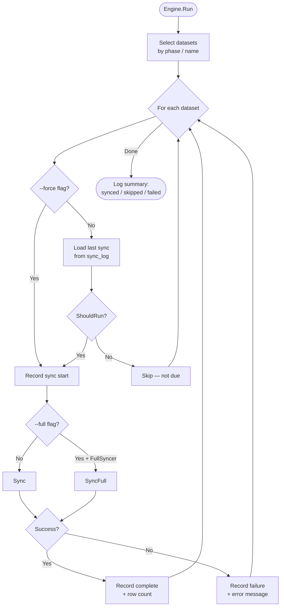
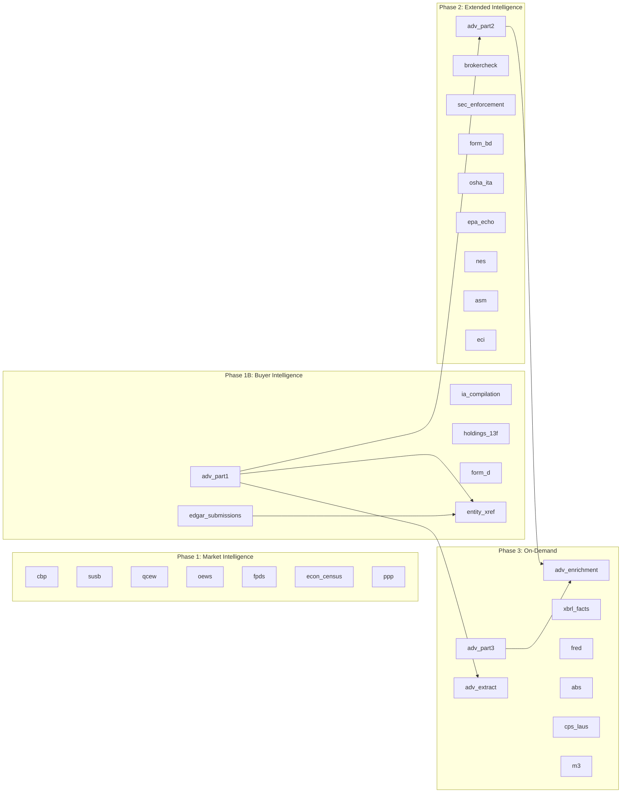
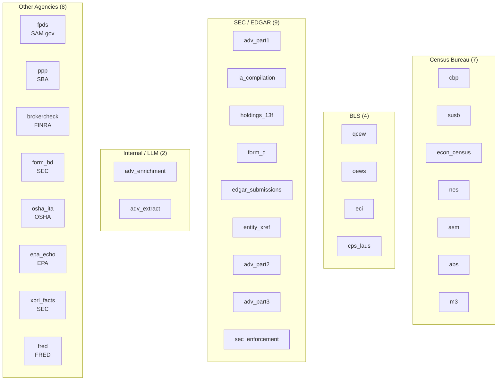

# Fedsync Dataset Catalog

> Complete reference for all 30 federal datasets synced by the fedsync subsystem.

## Quick Reference

| # | Name | Phase | Cadence | Source Agency | Target Table | API Key |
|---|------|-------|---------|--------------|--------------|---------|
| 1 | `cbp` | 1 | Annual | Census | `fed_data.cbp_data` | No |
| 2 | `susb` | 1 | Annual | Census | `fed_data.susb_data` | No |
| 3 | `qcew` | 1 | Quarterly | BLS | `fed_data.qcew_data` | No |
| 4 | `oews` | 1 | Annual | BLS | `fed_data.oews_data` | No |
| 5 | `fpds` | 1 | Daily | SAM.gov | `fed_data.fpds_contracts` | SAM |
| 6 | `econ_census` | 1 | Annual | Census | `fed_data.economic_census` | Census |
| 7 | `ppp` | 1 | One-time | SBA | `fed_data.ppp_loans` | No |
| 8 | `adv_part1` | 1B | Monthly | SEC | `fed_data.adv_filings` | No |
| 9 | `ia_compilation` | 1B | Daily | SEC | `fed_data.adv_firms` | No |
| 10 | `holdings_13f` | 1B | Quarterly | SEC | `fed_data.f13_holdings` | No |
| 11 | `form_d` | 1B | Daily | SEC | `fed_data.form_d` | No |
| 12 | `edgar_submissions` | 1B | Weekly | SEC | `fed_data.edgar_entities` | No |
| 13 | `entity_xref` | 1B | Monthly | Internal | `fed_data.entity_xref` | No |
| 14 | `adv_part2` | 2 | Monthly | SEC | `fed_data.adv_brochures` | Mistral* |
| 15 | `brokercheck` | 2 | Monthly | FINRA | `fed_data.brokercheck` | No |
| 16 | `sec_enforcement` | 2 | Monthly | SEC | `fed_data.sec_enforcement_actions` | No |
| 17 | `form_bd` | 2 | Monthly | SEC | `fed_data.form_bd` | No |
| 18 | `osha_ita` | 2 | Annual | OSHA | `fed_data.osha_inspections` | No |
| 19 | `epa_echo` | 2 | Monthly | EPA | `fed_data.epa_facilities` | No |
| 20 | `nes` | 2 | Annual | Census | `fed_data.nes_data` | Census |
| 21 | `asm` | 2 | Annual | Census | `fed_data.asm_data` | Census |
| 22 | `eci` | 2 | Quarterly | BLS | `fed_data.eci_data` | BLS |
| 23 | `adv_part3` | 3 | Monthly | SEC | `fed_data.adv_crs` | Mistral* |
| 24 | `adv_enrichment` | 3 | Monthly | Internal | `fed_data.adv_brochure_enrichment` | Anthropic |
| 25 | `adv_extract` | 3 | Monthly | Internal | `fed_data.adv_advisor_answers` | Anthropic |
| 26 | `xbrl_facts` | 3 | Daily | SEC | `fed_data.xbrl_facts` | No |
| 27 | `fred` | 3 | Monthly | FRED | `fed_data.fred_series` | FRED |
| 28 | `abs` | 3 | Annual | Census | `fed_data.abs_data` | Census |
| 29 | `cps_laus` | 3 | Monthly | BLS | `fed_data.laus_data` | BLS |
| 30 | `m3` | 3 | Monthly | Census | `fed_data.m3_data` | Census |

\* Mistral API key required only when OCR provider is set to `mistral` (fallback mode). Local `pdftotext` requires no key.

## Dataset Lifecycle

## Phase Dependency Graph

## Source Agency Groupings

---

## Phase 1: Market Intelligence

7 datasets covering Census, BLS, and SAM.gov market data.

### cbp — County Business Patterns

| Field | Value |
|---|---|
| Source | `https://www2.census.gov/programs-surveys/cbp/datasets/{year}/cbp{yy}co.zip` |
| Table | `fed_data.cbp_data` |
| Cadence | Annual (after March) |
| Schedule | `AnnualAfter(March)` |
| Conflict Keys | `year`, `fips_state`, `fips_county`, `naics` |
| Batch Size | 5,000 |
| API Key | No |
| File | `internal/fedsync/dataset/cbp.go` |

### susb — Statistics of U.S. Businesses

| Field | Value |
|---|---|
| Source | `https://www2.census.gov/programs-surveys/susb/datasets/{year}/us_state_6digitnaics_{year}.txt` |
| Table | `fed_data.susb_data` |
| Cadence | Annual (after March) |
| Schedule | `AnnualAfter(March)` |
| Conflict Keys | `year`, `fips_state`, `naics`, `entrsizedscr` |
| Batch Size | 5,000 |
| API Key | No |
| File | `internal/fedsync/dataset/susb.go` |

### qcew — Quarterly Census of Employment and Wages

| Field | Value |
|---|---|
| Source | `https://data.bls.gov/cew/data/files/{year}/csv/{year}_qtrly_by_industry.zip` |
| Table | `fed_data.qcew_data` |
| Cadence | Quarterly (5-month lag) |
| Schedule | `QuarterlyWithLag(5 months)` |
| Conflict Keys | `area_fips`, `own_code`, `industry_code`, `year`, `qtr` |
| Batch Size | 20,000 |
| API Key | No |
| File | `internal/fedsync/dataset/qcew.go` |

### oews — Occupational Employment and Wage Statistics

| Field | Value |
|---|---|
| Source | `https://www.bls.gov/oes/special-requests/oesm{yy}nat.zip` |
| Table | `fed_data.oews_data` |
| Cadence | Annual (after April) |
| Schedule | `AnnualAfter(April)` |
| Conflict Keys | `area_code`, `naics`, `occ_code`, `year` |
| Batch Size | 5,000 |
| API Key | No |
| File | `internal/fedsync/dataset/oews.go` |

### fpds — Federal Procurement Data System

| Field | Value |
|---|---|
| Source | `https://api.sam.gov/opportunities/v2/search` |
| Table | `fed_data.fpds_contracts` |
| Cadence | Daily |
| Schedule | `DailySchedule` |
| Conflict Keys | `contract_id` |
| Batch Size | 5,000 |
| API Key | **SAM** (`RESEARCH_FEDSYNC_SAM_API_KEY`) |
| File | `internal/fedsync/dataset/fpds.go` |

### econ_census — Economic Census

| Field | Value |
|---|---|
| Source | `https://api.census.gov/data/{year}/ecnbasic` |
| Table | `fed_data.economic_census` |
| Cadence | Annual (5-year cycle, after March) |
| Schedule | `AnnualAfter(March)` + 5-year release check |
| Conflict Keys | `year`, `geo_id`, `naics` |
| Batch Size | 5,000 |
| API Key | **Census** (`RESEARCH_FEDSYNC_CENSUS_API_KEY`) |
| File | `internal/fedsync/dataset/econ_census.go` |

### ppp — Paycheck Protection Program

| Field | Value |
|---|---|
| Source | `https://data.sba.gov/api/3/action/package_show?id=8aa276e2-6cab-4f86-aca4-a7dde42adf24` |
| Table | `fed_data.ppp_loans` |
| Cadence | One-time (runs only if never synced) |
| Schedule | `lastSync == nil` |
| Conflict Keys | `loannumber` |
| Batch Size | 10,000 |
| API Key | No |
| File | `internal/fedsync/dataset/ppp.go` |

---

## Phase 1B: Buyer Intelligence (SEC/EDGAR)

6 datasets focused on SEC and EDGAR filings for investment advisor intelligence.

### adv_part1 — ADV Part 1A Filings

| Field | Value |
|---|---|
| Source | `https://reports.adviserinfo.sec.gov/reports/foia/reports_metadata.json` |
| Table | `fed_data.adv_filings` |
| Cadence | Monthly |
| Schedule | `MonthlySchedule` |
| Conflict Keys | `crd_number`, `filing_date` |
| Batch Size | 10,000 |
| API Key | No |
| File | `internal/fedsync/dataset/adv_part1.go` |

### ia_compilation — IARD Compilation Reports

| Field | Value |
|---|---|
| Source | `https://reports.adviserinfo.sec.gov/reports/CompilationReports/CompilationReports.manifest.json` |
| Table | `fed_data.adv_firms` |
| Cadence | Daily |
| Schedule | `DailySchedule` |
| Conflict Keys | `crd_number` (firms), `crd_number` + `filing_date` (filings) |
| Batch Size | 2,000 |
| API Key | No |
| File | `internal/fedsync/dataset/ia_compilation.go` |

### holdings_13f — SEC 13F Holdings

| Field | Value |
|---|---|
| Source | `https://efts.sec.gov/LATEST/search-index` |
| Table | `fed_data.f13_holdings` |
| Cadence | Quarterly (45-day delay) |
| Schedule | `QuarterlyAfterDelay(45 days)` |
| Conflict Keys | `cik`, `period`, `cusip` |
| Batch Size | 5,000 |
| API Key | No |
| File | `internal/fedsync/dataset/holdings_13f.go` |

### form_d — EDGAR Form D Filings

| Field | Value |
|---|---|
| Source | `https://efts.sec.gov/LATEST/search-index` |
| Table | `fed_data.form_d` |
| Cadence | Daily |
| Schedule | `DailySchedule` |
| Conflict Keys | `accession_number` |
| Batch Size | 2,000 |
| API Key | No |
| File | `internal/fedsync/dataset/form_d.go` |

### edgar_submissions — EDGAR Bulk Submissions

| Field | Value |
|---|---|
| Source | `https://www.sec.gov/Archives/edgar/daily-index/bulkdata/submissions.zip` |
| Table | `fed_data.edgar_entities` |
| Cadence | Weekly |
| Schedule | `WeeklySchedule` |
| Conflict Keys | `cik` (entities), `accession_number` (filings) |
| Batch Size | 10,000 |
| API Key | No |
| File | `internal/fedsync/dataset/edgar_submissions.go` |

### entity_xref — Entity Cross-Reference

| Field | Value |
|---|---|
| Source | Internal — cross-references `adv_part1` + `edgar_submissions` |
| Table | `fed_data.entity_xref` |
| Cadence | Monthly |
| Schedule | Always true (manual/force trigger) |
| Conflict Keys | N/A |
| Batch Size | N/A |
| API Key | No |
| Dependencies | `adv_part1`, `edgar_submissions` |
| File | `internal/fedsync/dataset/entity_xref.go` |

---

## Phase 2: Extended Intelligence

9 datasets covering FINRA, OSHA, EPA, and additional Census/BLS data.

### adv_part2 — ADV Brochure PDFs (Part 2)

| Field | Value |
|---|---|
| Source | `https://reports.adviserinfo.sec.gov/reports/foia/reports_metadata.json` |
| Table | `fed_data.adv_brochures` |
| Cadence | Monthly |
| Schedule | `MonthlySchedule` |
| Conflict Keys | `crd_number`, `brochure_id` |
| Batch Size | 100 |
| API Key | Mistral (fallback OCR only) |
| Dependencies | `adv_part1` |
| File | `internal/fedsync/dataset/adv_part2.go` |

### brokercheck — FINRA BrokerCheck

| Field | Value |
|---|---|
| Source | `https://files.brokercheck.finra.org/firm/firm.zip` |
| Table | `fed_data.brokercheck` |
| Cadence | Monthly |
| Schedule | `MonthlySchedule` |
| Conflict Keys | `crd_number` |
| Batch Size | 5,000 |
| API Key | No |
| File | `internal/fedsync/dataset/brokercheck.go` |

### sec_enforcement — SEC Enforcement Actions

| Field | Value |
|---|---|
| Source | `https://efts.sec.gov/LATEST/search-index?q=%22enforcement+action%22` |
| Table | `fed_data.sec_enforcement_actions` |
| Cadence | Monthly |
| Schedule | `MonthlySchedule` |
| Conflict Keys | `action_id` |
| Batch Size | N/A |
| API Key | No |
| File | `internal/fedsync/dataset/sec_enforcement.go` |

### form_bd — Form BD Broker-Dealer

| Field | Value |
|---|---|
| Source | `https://www.sec.gov/files/data/broker-dealer-data/bd_firm.zip` |
| Table | `fed_data.form_bd` |
| Cadence | Monthly |
| Schedule | `MonthlySchedule` |
| Conflict Keys | `crd_number` |
| Batch Size | 5,000 |
| API Key | No |
| File | `internal/fedsync/dataset/form_bd.go` |

### osha_ita — OSHA Inspections

| Field | Value |
|---|---|
| Source | `https://www.osha.gov/severeinjury/xml/severeinjury.zip` |
| Table | `fed_data.osha_inspections` |
| Cadence | Annual (after March) |
| Schedule | `AnnualAfter(March)` |
| Conflict Keys | `activity_nr` |
| Batch Size | 5,000 |
| API Key | No |
| File | `internal/fedsync/dataset/osha_ita.go` |

### epa_echo — EPA ECHO Facilities

| Field | Value |
|---|---|
| Source | `https://ordsext.epa.gov/FLA/www3/state_files/national_single.zip` |
| Table | `fed_data.epa_facilities` |
| Cadence | Monthly |
| Schedule | `MonthlySchedule` |
| Conflict Keys | `registry_id` |
| Batch Size | 5,000 |
| API Key | No |
| File | `internal/fedsync/dataset/epa_echo.go` |

### nes — Nonemployer Statistics

| Field | Value |
|---|---|
| Source | `https://api.census.gov/data/{year}/nonemp` |
| Table | `fed_data.nes_data` |
| Cadence | Annual (after March) |
| Schedule | `AnnualAfter(March)` |
| Conflict Keys | `year`, `naics`, `geo_id` |
| Batch Size | N/A |
| API Key | **Census** (`RESEARCH_FEDSYNC_CENSUS_API_KEY`) |
| File | `internal/fedsync/dataset/nes.go` |

### asm — Annual Survey of Manufactures

| Field | Value |
|---|---|
| Source | `https://api.census.gov/data/{year}/asm/product` |
| Table | `fed_data.asm_data` |
| Cadence | Annual (after March) |
| Schedule | `AnnualAfter(March)` |
| Conflict Keys | `year`, `naics`, `geo_id` |
| Batch Size | N/A |
| API Key | **Census** (`RESEARCH_FEDSYNC_CENSUS_API_KEY`) |
| File | `internal/fedsync/dataset/asm.go` |

### eci — Employment Cost Index

| Field | Value |
|---|---|
| Source | `https://api.bls.gov/publicAPI/v2/timeseries/data/{seriesID}` |
| Table | `fed_data.eci_data` |
| Cadence | Quarterly (2-month lag) |
| Schedule | `QuarterlyWithLag(2 months)` |
| Conflict Keys | `series_id`, `year`, `period` |
| Batch Size | N/A |
| API Key | **BLS** (`RESEARCH_FEDSYNC_BLS_API_KEY`) |
| File | `internal/fedsync/dataset/eci.go` |

---

## Phase 3: On-Demand

8 datasets including XBRL, FRED, and LLM-enriched ADV data.

### adv_part3 — CRS PDFs (Part 3 / Client Relationship Summary)

| Field | Value |
|---|---|
| Source | `https://reports.adviserinfo.sec.gov/reports/foia/reports_metadata.json` |
| Table | `fed_data.adv_crs` |
| Cadence | Monthly |
| Schedule | `MonthlySchedule` |
| Conflict Keys | `crd_number`, `crs_id` |
| Batch Size | 100 |
| API Key | Mistral (fallback OCR only) |
| File | `internal/fedsync/dataset/adv_part3.go` |

### adv_enrichment — ADV Brochure Enrichment (LLM)

| Field | Value |
|---|---|
| Source | Internal — reads `adv_brochures` + `adv_crs` tables |
| Table | `fed_data.adv_brochure_enrichment` |
| Cadence | Monthly |
| Schedule | `MonthlySchedule` |
| Conflict Keys | `crd_number`, `brochure_id` (brochures); `crd_number`, `crs_id` (crs) |
| Batch Size | 50 |
| API Key | **Anthropic** (`RESEARCH_ANTHROPIC_KEY`) |
| Dependencies | `adv_part2`, `adv_part3` |
| File | `internal/fedsync/dataset/adv_enrichment.go` |

### adv_extract — ADV Advisor Answers (LLM)

| Field | Value |
|---|---|
| Source | Internal — reads `adv_filings` table |
| Table | `fed_data.adv_advisor_answers` |
| Cadence | Monthly |
| Schedule | `MonthlySchedule` |
| Conflict Keys | N/A |
| Batch Size | N/A |
| API Key | **Anthropic** (`RESEARCH_ANTHROPIC_KEY`) |
| Dependencies | `adv_part1` |
| File | `internal/fedsync/dataset/adv_extract.go` |

### xbrl_facts — EDGAR XBRL Facts

| Field | Value |
|---|---|
| Source | `https://data.sec.gov/api/xbrl/companyfacts/CIK{cik}.json` |
| Table | `fed_data.xbrl_facts` |
| Cadence | Daily |
| Schedule | `DailySchedule` |
| Conflict Keys | `cik`, `fact_name`, `period_end` |
| Batch Size | 5,000 |
| API Key | No |
| File | `internal/fedsync/dataset/xbrl_facts.go` |

### fred — FRED Economic Series

| Field | Value |
|---|---|
| Source | `https://api.stlouisfed.org/fred/series/observations` |
| Table | `fed_data.fred_series` |
| Cadence | Monthly |
| Schedule | `MonthlySchedule` |
| Conflict Keys | `series_id`, `obs_date` |
| Batch Size | N/A |
| API Key | **FRED** (`RESEARCH_FEDSYNC_FRED_API_KEY`) |
| File | `internal/fedsync/dataset/fred.go` |

### abs — Annual Business Survey

| Field | Value |
|---|---|
| Source | `https://api.census.gov/data/{year}/abscs` |
| Table | `fed_data.abs_data` |
| Cadence | Annual (after March) |
| Schedule | `AnnualAfter(March)` |
| Conflict Keys | `year`, `naics`, `geo_id` |
| Batch Size | N/A |
| API Key | **Census** (`RESEARCH_FEDSYNC_CENSUS_API_KEY`) |
| File | `internal/fedsync/dataset/abs.go` |

### cps_laus — CPS / Local Area Unemployment Statistics

| Field | Value |
|---|---|
| Source | `https://api.bls.gov/publicAPI/v2/timeseries/data/{seriesID}` |
| Table | `fed_data.laus_data` |
| Cadence | Monthly |
| Schedule | `MonthlySchedule` |
| Conflict Keys | `series_id`, `year`, `period` |
| Batch Size | N/A |
| API Key | **BLS** (`RESEARCH_FEDSYNC_BLS_API_KEY`) |
| File | `internal/fedsync/dataset/cps_laus.go` |

### m3 — Manufacturers' Shipments, Inventories, and Orders

| Field | Value |
|---|---|
| Source | `https://api.census.gov/data/timeseries/eits/m3` |
| Table | `fed_data.m3_data` |
| Cadence | Monthly |
| Schedule | `MonthlySchedule` |
| Conflict Keys | `category`, `data_type`, `year`, `month` |
| Batch Size | N/A |
| API Key | **Census** (`RESEARCH_FEDSYNC_CENSUS_API_KEY`) |
| File | `internal/fedsync/dataset/m3.go` |

---

## API Key Requirements

| Key | Env Variable | Datasets |
|---|---|---|
| SAM.gov | `RESEARCH_FEDSYNC_SAM_API_KEY` | `fpds` |
| Census | `RESEARCH_FEDSYNC_CENSUS_API_KEY` | `econ_census`, `nes`, `asm`, `abs`, `m3` |
| BLS | `RESEARCH_FEDSYNC_BLS_API_KEY` | `eci`, `cps_laus` |
| FRED | `RESEARCH_FEDSYNC_FRED_API_KEY` | `fred` |
| Anthropic | `RESEARCH_ANTHROPIC_KEY` | `adv_enrichment`, `adv_extract` |
| Mistral | `RESEARCH_FEDSYNC_MISTRAL_API_KEY` | `adv_part2`*, `adv_part3`* |

\* Mistral is only required when `fedsync.ocr.provider` is set to `mistral`. The default `local` provider uses `pdftotext` with no API key.

## Schedule Reference

| Schedule Function | Behavior |
|---|---|
| `DailySchedule` | Runs if last sync was before today |
| `WeeklySchedule` | Runs if last sync was > 7 days ago |
| `MonthlySchedule` | Runs if last sync was > 30 days ago |
| `QuarterlyWithLag(N)` | Runs quarterly with N-month publication lag |
| `QuarterlyAfterDelay(N)` | Runs quarterly with N-day delay after quarter end |
| `AnnualAfter(month)` | Runs once per year after the given month |
| `lastSync == nil` | One-time load (PPP only) |
| Always true | Manual trigger only — requires `--force` (entity_xref) |

## Related Docs

- [System Architecture](architecture.md) — overall system context
- [Operational Runbook](runbook.md) — fedsync operations and troubleshooting
