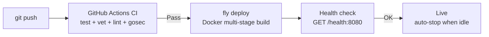
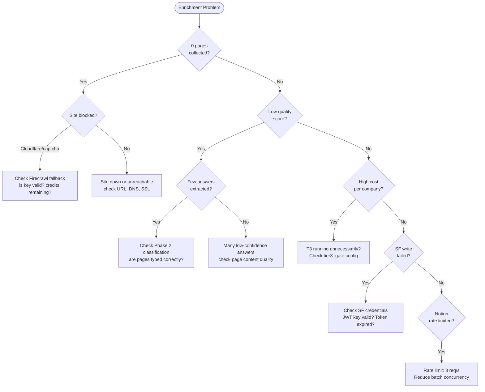

# Operational Runbook

> Deployment, monitoring, and troubleshooting guide for research-cli.

## Quick Reference Commands

| Task | Command |
|---|---|
| Build | `go build -o research-cli ./cmd` |
| Test all | `go test ./...` |
| Test specific | `go test ./internal/pipeline/ -run TestRouter -v` |
| Lint | `golangci-lint run ./...` |
| Run single company | `go run ./cmd run --url acme.com --sf-id 001xx` |
| Batch from Notion | `go run ./cmd batch --limit 100` |
| Import CSV | `go run ./cmd import --csv leads.csv` |
| Start webhook server | `go run ./cmd serve --port 8080` |
| Deploy to Fly | `fly deploy` |
| SSH to Fly machine | `fly ssh console` |
| Run batch on Fly | `fly ssh console -C "research-cli batch --limit 100"` |
| Fedsync migrate | `go run ./cmd fedsync migrate` |
| Fedsync status | `go run ./cmd fedsync status` |
| Fedsync sync all | `go run ./cmd fedsync sync` |
| Fedsync sync phase | `go run ./cmd fedsync sync --phase 1` |
| Fedsync force sync | `go run ./cmd fedsync sync --datasets cbp,fpds --force` |
| Fedsync full reload | `go run ./cmd fedsync sync --datasets cbp --full` |
| View logs | `fly logs` |
| View recent logs | `fly logs --no-tail` |

## Deployment

### Prerequisites

- Go 1.25+
- [Fly CLI](https://fly.io/docs/flyctl/install/)
- Docker (for `fly deploy`)
- `golangci-lint` v2.10+

### First-Time Setup

```bash
# Clone and build
git clone <repo>
cd research-cli
go build -o research-cli ./cmd

# Local dev with SQLite (no external DB needed)
cp config.example.yaml config.yaml
# Edit config.yaml: set store.driver to "sqlite"

# Install pre-commit hook
ln -sf ../../scripts/pre-commit .git/hooks/pre-commit

# Fly.io setup
fly launch  # already configured via fly.toml
fly secrets set RESEARCH_ANTHROPIC_KEY=sk-...
```

### Secrets Checklist

All secrets are set via `fly secrets set`:

| Secret | Required | Purpose |
|---|---|---|
| `RESEARCH_DATABASE_URL` | Yes | Neon Postgres connection string |
| `RESEARCH_ANTHROPIC_KEY` | Yes | Claude API (extraction) |
| `RESEARCH_NOTION_TOKEN` | Yes | Notion integration token |
| `RESEARCH_NOTION_LEAD_DB` | Yes | Lead Tracker database ID |
| `RESEARCH_NOTION_QUESTION_DB` | Yes | Question Registry database ID |
| `RESEARCH_NOTION_FIELD_DB` | Yes | Field Registry database ID |
| `RESEARCH_FIRECRAWL_KEY` | Yes | Firecrawl (crawl fallback) |
| `RESEARCH_PERPLEXITY_KEY` | Yes | Perplexity (LinkedIn search) |
| `RESEARCH_JINA_KEY` | Yes | Jina (web reader + search) |
| `RESEARCH_SF_CLIENT_ID` | Yes | Salesforce Connected App |
| `RESEARCH_SF_USERNAME` | Yes | Salesforce JWT username |
| `RESEARCH_SF_KEY_PATH` | Yes | Path to SF JWT private key |
| `RESEARCH_TOOLJET_WEBHOOK` | Yes | Manual review webhook |
| `RESEARCH_FEDSYNC_SAM_API_KEY` | Fedsync | SAM.gov FPDS data |
| `RESEARCH_FEDSYNC_FRED_API_KEY` | Fedsync | FRED series |
| `RESEARCH_FEDSYNC_BLS_API_KEY` | Fedsync | BLS datasets (ECI, LAUS) |
| `RESEARCH_FEDSYNC_CENSUS_API_KEY` | Fedsync | Census datasets (5 datasets) |
| `RESEARCH_FEDSYNC_MISTRAL_API_KEY` | Optional | Mistral OCR fallback |
| `RESEARCH_FEDSYNC_N8N_WEBHOOK_URL` | Optional | n8n notifications |

### Deploy Pipeline



### Rolling Back

```bash
# List recent deployments
fly releases

# Roll back to previous release
fly deploy --image registry.fly.io/sells-research:deployment-<ID>
```

### Updating Secrets

```bash
# Update a single secret (triggers redeployment)
fly secrets set RESEARCH_ANTHROPIC_KEY=sk-new-key

# List current secrets (names only, not values)
fly secrets list
```

## Monitoring

### Health Check

The server exposes `GET /health` on port 8080. Fly.io checks every 15 seconds with a 5-second timeout and 30-second grace period.

### Log Fields

Structured JSON logs (production) include these standard fields:

| Field | Present In | Example |
|---|---|---|
| `company` | Enrichment | `"Acme Corp"` |
| `url` | Enrichment | `"acme.com"` |
| `phase` | Both | `"4_extract_t1"` |
| `tier` | Extraction | `"t1"`, `"t2"`, `"t3"` |
| `duration_ms` | Both | `1234` |
| `tokens` | Extraction | `50000` |
| `cost` | Extraction | `0.15` |
| `component` | Fedsync | `"fedsync.engine"` |
| `dataset` | Fedsync | `"cbp"` |
| `rows` | Fedsync | `150000` |
| `error` | Both | Error message |

### Enrichment Metrics

Per-company metrics are stored in the `runs` table and included in the enrichment report:

- **Quality score:** 0.0-1.0, with breakdown by category
- **Total cost:** Sum of all API costs for the run
- **Fields found / total:** Completion rate
- **Phase durations:** Time per phase in milliseconds
- **Token usage:** Input/output/cache tokens per model

### Fedsync Monitoring

```sql
-- Recent sync activity
SELECT dataset, status, rows_synced, started_at, completed_at,
       EXTRACT(EPOCH FROM (completed_at - started_at)) AS duration_secs
FROM fed_data.sync_log
ORDER BY started_at DESC
LIMIT 20;

-- Failed syncs
SELECT dataset, error_message, started_at
FROM fed_data.sync_log
WHERE status = 'failed'
ORDER BY started_at DESC;

-- Dataset freshness
SELECT dataset, MAX(completed_at) AS last_sync,
       NOW() - MAX(completed_at) AS age
FROM fed_data.sync_log
WHERE status = 'completed'
GROUP BY dataset
ORDER BY age DESC;
```

CLI shortcut: `go run ./cmd fedsync status`

## Troubleshooting

### Enrichment Issues



**0 pages collected:**
- Check if the site is blocked (Cloudflare, captcha). Look for `blocked: true` in Phase 1A metadata.
- Verify Firecrawl key is valid and has remaining credits.
- Check if the URL resolves (DNS, SSL issues).

**Low quality scores:**
- Review Phase 2 classification — pages may be mistyped.
- Check if the site has substantive content (some sites are thin landing pages).
- Try running with `--with-t3` flag to enable Opus analysis.

**High per-company cost:**
- Check if T3 is running unnecessarily — set `tier3_gate` to `"off"` or `"ambiguity_only"`.
- Review `max_cost_per_company_usd` budget setting.
- Check if answer caching is working (look for "skipped questions with existing high-confidence answers" log).

**SF write failures:**
- JWT token may have expired — check `RESEARCH_SF_KEY_PATH` points to a valid key.
- Connected App may need re-authorization.
- Field-level security: ensure the integration user has write access to all target fields.

**Notion rate limits:**
- The 3 req/s limit is enforced client-side. If seeing 429 errors, check `batch.max_concurrent_companies` isn't too high.

### Fedsync Issues

**Download failures:**
- **URL changed:** Federal data sources occasionally change URLs. Check the source URL in the dataset file (see [catalog](fedsync-catalog.md)).
- **Expired API key:** Census, BLS, FRED, SAM keys expire or get rotated. Re-generate and update via `fly secrets set`.
- **SEC rate limit:** EDGAR enforces 10 req/s. Check `User-Agent` header is set correctly (`RESEARCH_FEDSYNC_EDGAR_USER_AGENT`).

**0 rows synced:**
- **Not yet released:** Annual datasets release on specific schedules (most after March). Check the cadence and schedule function.
- **Already synced:** If not using `--force`, the engine checks `ShouldRun()`. Use `fedsync status` to see last sync times.
- **API returns empty:** The upstream API may be temporarily unavailable. Check the specific agency's status page.

**Migration failures:**
- Run `go run ./cmd fedsync migrate` manually to see the specific error.
- Migrations are idempotent — re-running is safe.
- Check for schema conflicts if running custom SQL against `fed_data.*` tables.

**entity_xref dependencies:**
- `entity_xref` cross-references `adv_part1` and `edgar_submissions`. Both must be synced first.
- Run: `go run ./cmd fedsync sync --datasets adv_part1,edgar_submissions --force` then `go run ./cmd fedsync sync --datasets entity_xref --force`

**OCR failures (adv_part2, adv_part3):**
- Default provider is `local` (pdftotext). Ensure `pdftotext` is installed (`apt-get install poppler-utils` on Linux).
- Mistral fallback requires `RESEARCH_FEDSYNC_MISTRAL_API_KEY`.
- Some PDFs are image-only — Mistral OCR handles these better than pdftotext.

### General Issues

**Database connection:**
- Check `RESEARCH_DATABASE_URL` is set and the Neon project is running.
- Neon auto-suspends after inactivity — first connection may take 1-2 seconds to wake.
- For local dev, ensure `store.driver` is set to `"sqlite"`.

**Fly.io machine:**
- Machines auto-stop when idle (`auto_stop_machines = "stop"`). They wake on incoming requests.
- If the machine won't start: `fly machine list` → `fly machine start <id>`
- Check machine memory: `performance-4x` with 8 GB should handle batch runs of 100 companies.

**CI failures:**
- **Coverage below 50%:** New code needs tests. Check `coverage.out` artifact for uncovered packages.
- **Lint errors:** Run `golangci-lint run ./...` locally to see the same errors.
- **gosec warnings:** Address security findings or add `//nolint:gosec` with justification.

## Scheduled Operations

### Dataset Cadences

| Frequency | Datasets | When |
|---|---|---|
| Daily | `fpds`, `ia_compilation`, `form_d`, `xbrl_facts` | Every day |
| Weekly | `edgar_submissions` | Every 7 days |
| Monthly | `adv_part1`, `adv_part2`, `adv_part3`, `adv_enrichment`, `adv_extract`, `brokercheck`, `sec_enforcement`, `form_bd`, `epa_echo`, `entity_xref`, `fred`, `cps_laus`, `m3` | Every 30 days |
| Quarterly | `qcew` (5-mo lag), `holdings_13f` (45-day delay), `eci` (2-mo lag) | Per-dataset schedule |
| Annual | `cbp`, `susb`, `oews`, `osha_ita`, `nes`, `asm`, `abs`, `econ_census` | After March/April |
| One-time | `ppp` | Only if never synced |

### Recommended Sync Schedule

```bash
# Daily (via Fly.io cron or external scheduler)
research-cli fedsync sync --phase 1   # Phase 1: includes daily FPDS
research-cli fedsync sync --phase 1b  # Phase 1B: includes daily IA, Form D

# Weekly
research-cli fedsync sync --phase 1b  # Catches weekly EDGAR submissions

# Monthly
research-cli fedsync sync             # All phases — monthly datasets due

# Quarterly (after data release + lag)
research-cli fedsync sync --datasets qcew,holdings_13f,eci --force

# Annually (after March)
research-cli fedsync sync --datasets cbp,susb,oews,osha_ita,nes,asm,abs --force
```

## Related Docs

- [System Architecture](architecture.md) — deployment topology and services
- [Pipeline Data Flow](data-flow.md) — understanding phase failures
- [Fedsync Dataset Catalog](fedsync-catalog.md) — dataset details and schedules
- [API Cost Model](cost-model.md) — monitoring and controlling costs
