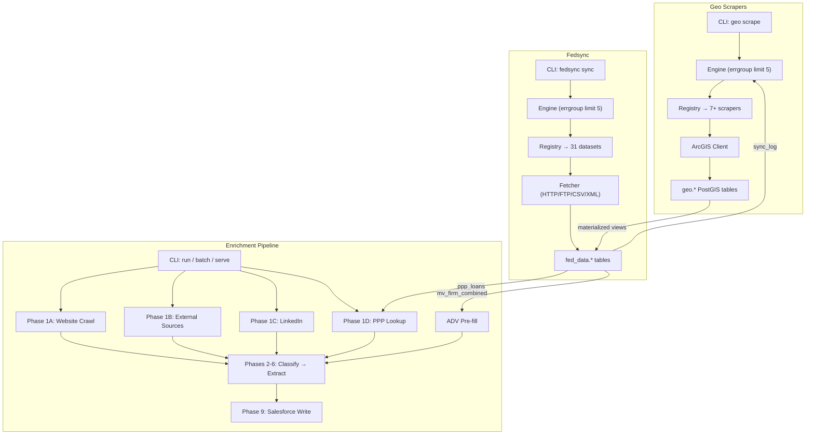
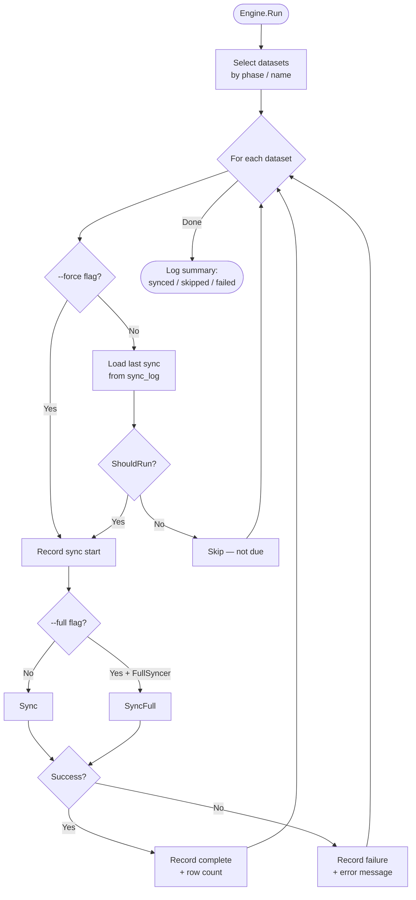
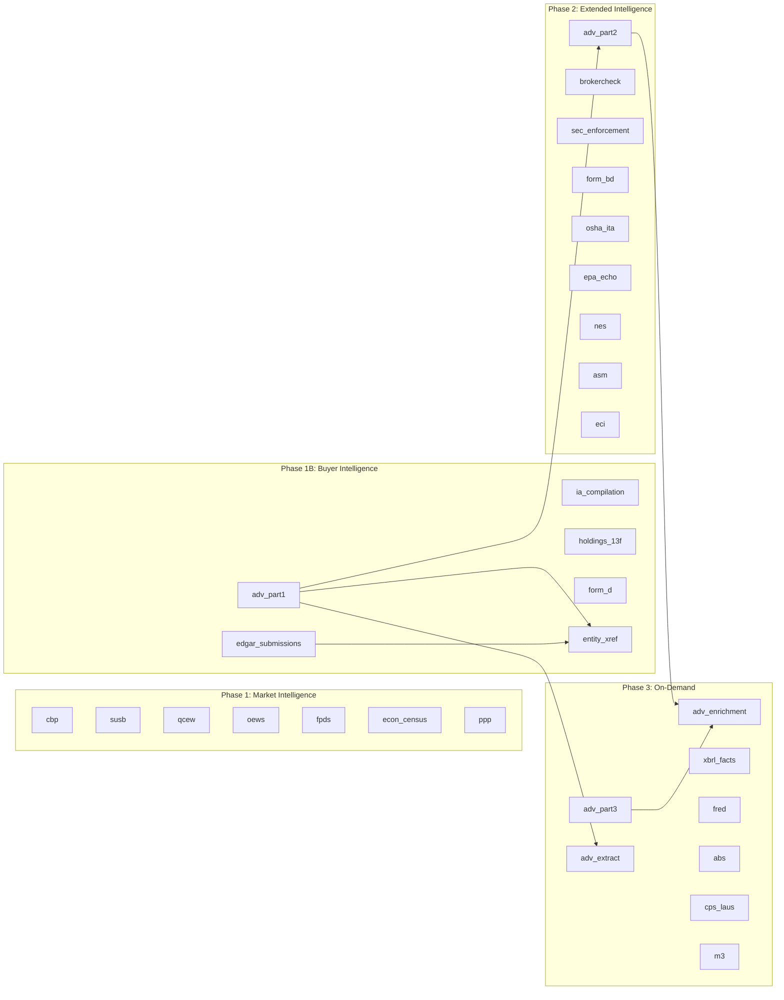
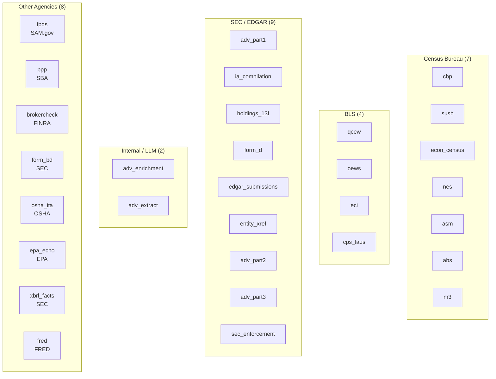

# Scraper Catalog

> Unified inventory and reference for all scrapers across three subsystems:
> Enrichment Pipeline, Geo Scrapers, and Fedsync Datasets.
>
> **Last updated:** 2026-03-01

---

## Master Inventory

| # | Name | Subsystem | Group | Source | Cadence | Target Table | Status | File | Linear |
|---|------|-----------|-------|--------|---------|-------------|--------|------|--------|
| 1 | `local_http` | Enrichment | Scrape Chain | Direct HTTP | Per-request | — | Implemented | `internal/scrape/local.go` | — |
| 2 | `jina` | Enrichment | Scrape Chain | Jina Reader API | Per-request | — | Implemented | `internal/scrape/jina.go` | — |
| 3 | `firecrawl` | Enrichment | Scrape Chain | Firecrawl API | Per-request | — | Implemented | `internal/scrape/firecrawl.go` | — |
| 4 | `google_maps` | Enrichment | External Sources | Google Maps / Jina / Perplexity / Places | Per-company | — | Implemented | `internal/pipeline/scrape.go` | — |
| 5 | `bbb` | Enrichment | External Sources | BBB via Jina Search | Per-company | — | Implemented | `internal/pipeline/scrape.go` | — |
| 6 | `sos` | Enrichment | External Sources | SoS via Jina Search | Per-company | — | Implemented | `internal/pipeline/scrape.go` | — |
| 7 | `linkedin` | Enrichment | LinkedIn | LinkedIn / Perplexity / Haiku | Per-company | — | Implemented | `internal/pipeline/linkedin.go` | — |
| 8 | `ppp_loans` | Enrichment | PPP Lookup | `fed_data.ppp_loans` | Per-company | — | Implemented | `internal/pipeline/ppp.go` | — |
| 9 | `adv_prefill` | Enrichment | ADV Pre-fill | `fed_data.mv_firm_combined` | Per-company | — | Implemented | `internal/pipeline/prefill.go` | — |
| 10 | `hifld_power_plants` | Geo | HIFLD | HIFLD ArcGIS | Quarterly | `geo.infrastructure` | Implemented | `internal/geoscraper/scraper/hifld_power_plants.go` | SELDEV-643 |
| 11 | `hifld_substations` | Geo | HIFLD | HIFLD ArcGIS | Quarterly | `geo.infrastructure` | Implemented | `internal/geoscraper/scraper/hifld_substations.go` | SELDEV-643 |
| 12 | `hifld_transmission_lines` | Geo | HIFLD | HIFLD ArcGIS | Quarterly | `geo.infrastructure` | Implemented | `internal/geoscraper/scraper/hifld_transmission_lines.go` | SELDEV-643 |
| 13 | `hifld_pipelines` | Geo | HIFLD | HIFLD ArcGIS | Quarterly | `geo.infrastructure` | Implemented | `internal/geoscraper/scraper/hifld_pipelines.go` | SELDEV-643 |
| 14 | `fema_flood` | Geo | FEMA | FEMA NFHL ArcGIS | Monthly | `geo.flood_zones` | Implemented | `internal/geoscraper/scraper/fema_flood.go` | SELDEV-644 |
| 15 | `epa_sites` | Geo | EPA | EPA FRS ArcGIS | Monthly | `geo.epa_sites` | Implemented | `internal/geoscraper/scraper/epa_sites.go` | SELDEV-645 |
| 16 | `census_demographics` | Geo | Census | Census ACS + TIGERweb | Annual | `geo.demographics` | Implemented | `internal/geoscraper/scraper/census_demographics.go` | SELDEV-646 |
| 17 | `fcc_broadband` | Geo | FCC | FCC BDC ArcGIS | Quarterly | `geo.infrastructure` | Merged | — | SELDEV-647 |
| 18 | `nrcs_soils` | Geo | NRCS | NRCS SSURGO ArcGIS | Annual | `geo.demographics` | Merged | — | SELDEV-648 |
| 19 | `tiger_roads` | Geo | TIGER | Census TIGER/Line | Annual | `geo.infrastructure` | Merged | — | SELDEV-649 |
| 20 | `osm_poi` | Geo | OSM | OpenStreetMap Overpass | Monthly | `geo.poi` | Merged | — | SELDEV-650 |
| 21 | `cbp` | Fedsync | Census | Census CBP ZIP | Annual | `fed_data.cbp_data` | Implemented | `internal/fedsync/dataset/cbp.go` | — |
| 22 | `susb` | Fedsync | Census | Census SUSB TXT | Annual | `fed_data.susb_data` | Implemented | `internal/fedsync/dataset/susb.go` | — |
| 23 | `qcew` | Fedsync | BLS | BLS QCEW ZIP | Quarterly | `fed_data.qcew_data` | Implemented | `internal/fedsync/dataset/qcew.go` | — |
| 24 | `oews` | Fedsync | BLS | BLS OEWS ZIP | Annual | `fed_data.oews_data` | Implemented | `internal/fedsync/dataset/oews.go` | — |
| 25 | `fpds` | Fedsync | SAM.gov | SAM.gov API | Daily | `fed_data.fpds_contracts` | Implemented | `internal/fedsync/dataset/fpds.go` | — |
| 26 | `econ_census` | Fedsync | Census | Census API | Annual | `fed_data.economic_census` | Implemented | `internal/fedsync/dataset/econ_census.go` | — |
| 27 | `ppp` | Fedsync | SBA | SBA CKAN | One-time | `fed_data.ppp_loans` | Implemented | `internal/fedsync/dataset/ppp.go` | — |
| 28 | `adv_part1` | Fedsync | SEC | IAPD FOIA | Monthly | `fed_data.adv_filings` | Implemented | `internal/fedsync/dataset/adv_part1.go` | — |
| 29 | `ia_compilation` | Fedsync | SEC | IARD XML | Daily | `fed_data.adv_firms` | Implemented | `internal/fedsync/dataset/ia_compilation.go` | — |
| 30 | `holdings_13f` | Fedsync | SEC | EFTS → 13F XML | Quarterly | `fed_data.f13_holdings` | Implemented | `internal/fedsync/dataset/holdings_13f.go` | — |
| 31 | `form_d` | Fedsync | SEC | EFTS → Form D XML | Daily | `fed_data.form_d` | Implemented | `internal/fedsync/dataset/form_d.go` | — |
| 32 | `edgar_submissions` | Fedsync | SEC | EDGAR bulk ZIP | Weekly | `fed_data.edgar_entities` | Implemented | `internal/fedsync/dataset/edgar_submissions.go` | — |
| 33 | `entity_xref` | Fedsync | Internal | CRD↔CIK matching | Monthly | `fed_data.entity_xref` | Implemented | `internal/fedsync/dataset/entity_xref.go` | — |
| 34 | `adv_part2` | Fedsync | SEC | IAPD → PDF OCR | Monthly | `fed_data.adv_brochures` | Implemented | `internal/fedsync/dataset/adv_part2.go` | — |
| 35 | `brokercheck` | Fedsync | FINRA | FINRA ZIP | Monthly | `fed_data.brokercheck` | Implemented | `internal/fedsync/dataset/brokercheck.go` | — |
| 36 | `sec_enforcement` | Fedsync | SEC | EFTS search | Monthly | `fed_data.sec_enforcement_actions` | Implemented | `internal/fedsync/dataset/sec_enforcement.go` | — |
| 37 | `form_bd` | Fedsync | SEC | SEC ZIP | Monthly | `fed_data.form_bd` | Implemented | `internal/fedsync/dataset/form_bd.go` | — |
| 38 | `osha_ita` | Fedsync | OSHA | OSHA ZIP | Annual | `fed_data.osha_inspections` | Implemented | `internal/fedsync/dataset/osha_ita.go` | — |
| 39 | `epa_echo` | Fedsync | EPA | EPA ECHO ZIP | Monthly | `fed_data.epa_facilities` | Implemented | `internal/fedsync/dataset/epa_echo.go` | — |
| 40 | `nes` | Fedsync | Census | Census API | Annual | `fed_data.nes_data` | Implemented | `internal/fedsync/dataset/nes.go` | — |
| 41 | `asm` | Fedsync | Census | Census API | Annual | `fed_data.asm_data` | Implemented | `internal/fedsync/dataset/asm.go` | — |
| 42 | `eci` | Fedsync | BLS | BLS API | Quarterly | `fed_data.eci_data` | Implemented | `internal/fedsync/dataset/eci.go` | — |
| 43 | `adv_part3` | Fedsync | SEC | IAPD → CRS PDF OCR | Monthly | `fed_data.adv_crs` | Implemented | `internal/fedsync/dataset/adv_part3.go` | — |
| 44 | `adv_enrichment` | Fedsync | Internal | LLM (Haiku) | Monthly | `fed_data.adv_brochure_enrichment` | Implemented | `internal/fedsync/dataset/adv_enrichment.go` | — |
| 45 | `adv_extract` | Fedsync | Internal | LLM (Haiku T1) | Monthly | `fed_data.adv_advisor_answers` | Implemented | `internal/fedsync/dataset/adv_extract.go` | — |
| 46 | `xbrl_facts` | Fedsync | SEC | EDGAR XBRL JSON | Daily | `fed_data.xbrl_facts` | Implemented | `internal/fedsync/dataset/xbrl_facts.go` | — |
| 47 | `fred` | Fedsync | FRED | FRED API | Monthly | `fed_data.fred_series` | Implemented | `internal/fedsync/dataset/fred.go` | — |
| 48 | `abs` | Fedsync | Census | Census API | Annual | `fed_data.abs_data` | Implemented | `internal/fedsync/dataset/abs.go` | — |
| 49 | `cps_laus` | Fedsync | BLS | BLS API | Monthly | `fed_data.laus_data` | Implemented | `internal/fedsync/dataset/cps_laus.go` | — |
| 50 | `m3` | Fedsync | Census | Census API | Monthly | `fed_data.m3_data` | Implemented | `internal/fedsync/dataset/m3.go` | — |
| 51 | `form_5500` | Fedsync | DOL | DOL EFAST2 FOIA bulk CSV/ZIP | Annual | `fed_data.form_5500` + 3 | Implemented | `internal/fedsync/dataset/form_5500.go` | — |

**Counts:** 9 enrichment + 7 geo (on main) + 4 geo (merged, other branch) + 31 fedsync = **51 implemented/merged**.
Planned scrapers are listed in [Planned Scrapers & Roadmap](#planned-scrapers--roadmap).

---

## Subsystem Architecture Overview



### Comparison

| Attribute | Enrichment Pipeline | Geo Scrapers | Fedsync |
|-----------|-------------------|--------------|---------|
| **Trigger** | CLI (`run` / `batch`), webhook | CLI (`geo scrape`) | CLI (`fedsync sync`), Fly.io cron |
| **Interface** | `scrape.Scraper` + pipeline phases | `GeoScraper` + `StateScraper` | `Dataset` + `FullSyncer` |
| **Concurrency** | `errgroup` (phases fan out) | `errgroup` (limit 5) | `errgroup` (limit 5) |
| **Schema** | `public` (enrichment tables) | `geo.*` (PostGIS) | `fed_data.*` |
| **Scheduling** | On-demand per company | `ShouldRun()` + `--force` | `ShouldRun()` + `--force` |
| **Package** | `internal/scrape/`, `internal/pipeline/` | `internal/geoscraper/` | `internal/fedsync/dataset/` |

---

## Enrichment Pipeline Scrapers

### Scrape Chain

The scrape chain (`internal/scrape/`) provides a priority-ordered fallback mechanism for fetching web pages. Each scraper implements the `Scraper` interface:

```go
// internal/scrape/scraper.go
type Scraper interface {
    Scrape(ctx context.Context, url string) (*Result, error)
    Name() string
    Supports(url string) bool
}
```

The `Chain` tries scrapers in order — first success wins. For batch operations, `ScrapeAll()` runs non-Firecrawl scrapers concurrently (limit 10), then batch-submits all failures to Firecrawl in a single API call.

#### `local_http` — Local HTTP Scraper

| Field | Value |
|-------|-------|
| Priority | 1 (tried first) |
| Cost | Free |
| File | `internal/scrape/local.go` |
| Timeout | 15s (HTTP client) |
| Max Body | 512 KB |
| User-Agent | `Mozilla/5.0 (compatible; ResearchBot/1.0)` |

Fetches via `net/http`, runs block detection (`blockdetect.go`), strips HTML to plaintext. Returns error on: block detected (cloudflare/captcha/js_shell), status >= 400, body < 100 bytes.

**Block Detection** (`internal/scrape/blockdetect.go`):

| Block Type | Detection |
|------------|-----------|
| `cloudflare` | Status 403/503 + cf-ray/cf-cache-status/server:cloudflare headers, or body contains "checking your browser" / "cf-browser-verification" |
| `captcha` | Body contains "captcha" / "recaptcha" / "hcaptcha" |
| `js_shell` | Body < 2000 bytes + `<noscript` + "javascript", or meta http-equiv="refresh" |

#### `jina` — Jina Reader with Circuit Breaker

| Field | Value |
|-------|-------|
| Priority | 2 |
| Cost | API credits |
| File | `internal/scrape/jina.go` |
| Circuit Breaker | 3 failures in 30s window → 60s cooldown |

Wraps `jina.Client.Read()`. Validates response: rejects nil, non-200 status, content < 100 bytes, and challenge signatures ("checking your browser", "enable javascript", "access denied", etc.) when content < 1000 bytes. Circuit breaker trips after 3 consecutive failures within 30 seconds, opens for 60 seconds.

#### `firecrawl` — Firecrawl Adapter

| Field | Value |
|-------|-------|
| Priority | 3 (universal fallback) |
| Cost | API credits |
| File | `internal/scrape/firecrawl.go` |
| Format | Markdown |

Wraps `firecrawl.Client.Scrape()`. Always returns `Supports() = true` — acts as the universal fallback. In batch mode, polls with 2s initial / 10s cap exponential backoff.

#### Path Matching

`PathMatcher` (`internal/scrape/pathmatcher.go`) excludes URLs by glob pattern. Default excludes: `/blog/*`, `/news/*`, `/press/*`, `/careers/*`. Supports multi-level matching (e.g., `/blog/*` matches `/blog/a/b/c`).

### Phase 1A: Website Crawl

**Files:** `internal/pipeline/crawl.go`, `internal/pipeline/localcrawl.go`

Orchestrates full website crawl for a company:

1. **Cache check** — return cached pages if available (24h TTL default)
2. **Probe** — `LocalCrawler.Probe()`: HEAD/GET homepage, check robots.txt + sitemap.xml, detect blocks
3. **Link discovery** — `LocalCrawler.DiscoverLinks()`: BFS from homepage, depth 2, cap 50 pages, seed from sitemap.xml
4. **Scrape all** — `chain.ScrapeAll()` with concurrency 10
5. **Fallback** — if blocked, no URLs found, or 0 pages fetched → `crawlViaFirecrawl()` (async crawl + poll)

The `LocalCrawler` uses breadth-first crawl with 5-URL batches, parallel link extraction (errgroup limit 5), and deduplication via seen-set.

### Phase 1B: External Sources

**File:** `internal/pipeline/scrape.go`

Fetches data from external sources in parallel via `errgroup`. Each source is defined by:

```go
type ExternalSource struct {
    Name            string
    URLFunc         func(company model.Company) string        // direct URL
    SearchQueryFunc func(company model.Company) (query, site string) // search-then-scrape
    ResultFilter    func(results []jina.SearchResult, company model.Company) *jina.SearchResult
    TimeoutSecs     int
    MaxRetries      *int
}
```

#### `google_maps`

| Field | Value |
|-------|-------|
| Strategy | URLFunc (direct URL) |
| URL | `https://www.google.com/maps/search/{name} {city} {state}` |
| Fallback Chain | Jina Search (0.85 confidence) → Perplexity (0.70) → Google Places API (0.98) |
| Extracts | Star rating (1.0–5.0), review count, phone number |
| Content Cleaning | Strips "Get the most out of Google Maps" footer |

#### `bbb`

| Field | Value |
|-------|-------|
| Strategy | SearchQueryFunc (search-then-scrape) |
| Query | `"{name}" {city} {state}` |
| Site Filter | `bbb.org` |
| Result Filter | `filterBBBResult` |
| Timeout | 15s (default) |
| Extracts | BBB rating (A+ to F), phone number |
| Content Cleaning | Strips cookie banners, nav, footer, 6 boilerplate sections |

#### `sos`

| Field | Value |
|-------|-------|
| Strategy | SearchQueryFunc (search-then-scrape) |
| Query | `"{name}" secretary of state business entity {state}` |
| Result Filter | `filterSoSResult` |
| Timeout | 20s |
| Max Retries | 1 |
| Extracts | Business entity registration info |

Pages are deduplicated by SHA-256 content hash. Addresses are cross-referenced via `CrossReferenceAddress()`.

### Phase 1C: LinkedIn

**File:** `internal/pipeline/linkedin.go`

| Field | Value |
|-------|-------|
| Cache TTL | 7 days (keyed by bare domain) |
| Primary | Chain scrape of `linkedin.com/company/{slug}` |
| Fallback | Perplexity (temp 0.2) |
| Extraction | Claude Haiku (max 1024 tokens) → JSON |

**Flow:** Cache lookup → chain scrape (detect login wall) → Perplexity fallback → Haiku JSON extraction → auto-populate exec fields from `ExecContacts[0]` → cache result.

**`LinkedInData` fields:** CompanyName, Description, Industry, EmployeeCount, Headquarters, Founded, Specialties, Website, LinkedInURL, CompanyType, ExecFirstName, ExecLastName, ExecTitle, ExecContacts (up to 3).

### Phase 1D: PPP Lookup

**File:** `internal/pipeline/ppp.go`

Fuzzy-matches company name + state + city against `fed_data.ppp_loans` via `ppp.Querier.FindLoans()`. Parses location from "City, ST" format. Returns `[]ppp.LoanMatch` with tier and score.

### ADV Pre-fill

**File:** `internal/pipeline/prefill.go`

Queries `fed_data.mv_firm_combined` by CRD number to pre-fill extraction answers before LLM runs.

| Field Key | Column | Derived |
|-----------|--------|---------|
| `aum_total`, `assets_under_management` | `aum` | No |
| `total_employees`, `employee_count` | `num_employees` | No |
| `num_accounts`, `client_count` | `num_accounts` | No |
| `regulatory_status` | — | Yes (SEC/ERA/state booleans → string) |
| `has_disciplinary_history` | `has_any_drp` | No |

Pre-filled answers get confidence 0.9, source "adv_filing", tier 0. Questions with all field keys pre-filled are filtered out of LLM extraction batches.

---

## Geo Scrapers

### Interfaces

```go
// internal/geoscraper/interface.go
type GeoScraper interface {
    Name() string
    Table() string
    Category() Category                                    // National | State | OnDemand
    Cadence() Cadence                                      // Daily | Weekly | Monthly | Quarterly | Annual
    ShouldRun(now time.Time, lastSync *time.Time) bool
    Sync(ctx context.Context, pool db.Pool, f fetcher.Fetcher, tempDir string) (*SyncResult, error)
}

type StateScraper interface {
    GeoScraper
    States() []string  // FIPS codes
}

type AddressProducer interface {
    HasAddresses() bool  // triggers postsync geocoding
}
```

Categories: `National` (1), `State` (2), `OnDemand` (3). Cadences re-exported from `fedsync/dataset`.

### ArcGIS Client

**Package:** `internal/geoscraper/arcgis/`

`QueryAll(ctx, fetcher, config, pageCallback)` paginates through ArcGIS FeatureServer/MapServer endpoints. Default page size: 2,000. Stops when `ExceededTransferLimit = false`.

```go
type QueryConfig struct {
    BaseURL   string   // FeatureServer/0/query endpoint
    Where     string   // SQL WHERE (default "1=1")
    OutFields []string // default ["*"]
    PageSize  int      // default 2000
    OutSR     int      // spatial reference WKID (e.g., 4326)
}
```

**Geometry support:**

| Type | Fields | PostGIS Conversion |
|------|--------|--------------------|
| Point | `X`, `Y` | Direct lat/lon columns |
| Polyline | `Paths` | Bounding box in JSONB `properties` |
| Polygon | `Rings` | `RingsToEWKT()` → `ST_GeomFromEWKT()` |

### Scraper Inventory

#### HIFLD Infrastructure (4 scrapers)

**Source:** US DHS Homeland Infrastructure Foundation-Level Data
**Base URL:** `https://services1.arcgis.com/Hp6G80Pky0om6HgA/ArcGIS/rest/services/{Layer}/FeatureServer/0/query`
**Target:** `geo.infrastructure` | **Conflict:** `(source, source_id)` | **Batch:** 5,000 | **Source ID:** `"hifld"`

| Scraper | ArcGIS Layer | Type | Key Attributes |
|---------|-------------|------|----------------|
| `hifld_power_plants` | `Power_Plants` | `power_plant` | PLANT_NAME, PRIM_FUEL, NAMEPCAP (MW) |
| `hifld_substations` | `Electric_Substations` | `substation` | NAME, MAX_VOLT |
| `hifld_transmission_lines` | `Electric_Power_Transmission_Lines` | `transmission_line` | OWNER, VOLTAGE + bbox |
| `hifld_pipelines` | `Natural_Gas_Pipelines` | `pipeline` | Operator + bbox |

**Upsert:** `db.BulkUpsert()` with conflict on `(source, source_id)`.

#### FEMA Flood Zones (1 scraper)

| Field | Value |
|-------|-------|
| Name | `fema_flood` |
| Source | FEMA NFHL ArcGIS |
| URL | `https://services.arcgis.com/P3ePLMYs2RVChkJx/arcgis/rest/services/USA_Flood_Hazard_Reduced_Set/FeatureServer/0/query` |
| Table | `geo.flood_zones` |
| Cadence | Monthly |
| Conflict | `(source, source_id)` |
| Geometry | MultiPolygon → EWKT |
| Coverage | 56 jurisdictions (50 states + DC + 5 territories) |
| WHERE | `DFIRM_ID LIKE '{state_fips}%'` |

**Flood type derivation:**

| Condition | Type |
|-----------|------|
| Zone D | `undetermined` |
| SFHA_TF = 'T' | `high_risk` |
| Zone X + "0.2 PCT" subtype | `moderate_risk` |
| Zone X (other) | `low_risk` |

**Upsert:** Custom EWKT — temp table with TEXT `geom_wkt` → dedup → INSERT with `ST_GeomFromEWKT()` conversion.

#### EPA Facility Registry (1 scraper)

| Field | Value |
|-------|-------|
| Name | `epa_sites` |
| Source | EPA FRS ArcGIS |
| URL | `https://geodata.epa.gov/arcgis/rest/services/OEI/FRS_INTERESTS/MapServer/0/query` |
| Table | `geo.epa_sites` |
| Cadence | Monthly |
| Conflict | `(source, source_id)` |
| Geometry | Point |
| Coverage | 56 jurisdictions (by postal abbreviation) |
| WHERE | `STATE_CODE='{state_abbrev}'` |

**Columns:** name (PRIMARY_NAME), program (PGM_SYS_ACRNM), registry_id (REGISTRY_ID, UNIQUE), status (ACTIVE_STATUS), lat/lon from centroid.

**Upsert:** `db.BulkUpsert()` with batch size 5,000.

#### Census Demographics (1 scraper)

| Field | Value |
|-------|-------|
| Name | `census_demographics` |
| Source | Census ACS 5-year + TIGERweb |
| ACS URL | `https://api.census.gov/data/{year}/acs/acs5` |
| TIGERweb URL | `https://tigerweb.geo.census.gov/arcgis/rest/services/TIGERweb/tigerWMS_Census2020/MapServer/8/query` |
| Table | `geo.demographics` |
| Cadence | Annual (January) |
| Conflict | `(geoid, geo_level, year)` |
| Geometry | MultiPolygon → EWKT |
| API Key | **Census** (`RESEARCH_FEDSYNC_CENSUS_API_KEY`) |

**ACS Variables:** B01003_001E (population), B19013_001E (median income), B01002_001E (median age), B25001_001E (housing units). Two-step sync per state: ACS tabular data → TIGERweb tract geometries → join by GEOID.

### Engine Orchestration

**File:** `internal/geoscraper/engine.go`

1. `Registry.Select(category, sources, states)` filters scrapers
2. `errgroup` with limit **5** concurrent scrapers
3. Per scraper: check `ShouldRun()` → 60-minute timeout → `Sync()` → postsync geocoding
4. PostSync: if `AddressProducer.HasAddresses()`, enqueue up to 10,000 rows to `geo.geocode_queue`; batches ≤100 processed immediately
5. All runs recorded in `fed_data.sync_log` (shared with fedsync)

### Database Schema

All tables in `geo` schema. Four tables directly populated by scrapers:

#### `geo.infrastructure`

```sql
CREATE TABLE geo.infrastructure (
    id         SERIAL PRIMARY KEY,
    name       TEXT NOT NULL,
    type       TEXT NOT NULL,       -- power_plant, substation, transmission_line, pipeline
    fuel_type  TEXT,
    capacity   DOUBLE PRECISION,
    geom       GEOMETRY(Point, 4326),
    latitude   DOUBLE PRECISION NOT NULL,
    longitude  DOUBLE PRECISION NOT NULL,
    source     TEXT NOT NULL,       -- "hifld"
    source_id  TEXT,
    properties JSONB DEFAULT '{}',
    created_at TIMESTAMPTZ NOT NULL DEFAULT now(),
    updated_at TIMESTAMPTZ NOT NULL DEFAULT now()
);
-- UNIQUE INDEX (source, source_id)
```

#### `geo.flood_zones`

```sql
CREATE TABLE geo.flood_zones (
    id         SERIAL PRIMARY KEY,
    zone_code  TEXT NOT NULL,
    flood_type TEXT NOT NULL,       -- high_risk, moderate_risk, low_risk, undetermined
    geom       GEOMETRY(MultiPolygon, 4326),
    source     TEXT NOT NULL DEFAULT 'fema',
    source_id  TEXT,
    properties JSONB DEFAULT '{}',
    created_at TIMESTAMPTZ NOT NULL DEFAULT now(),
    updated_at TIMESTAMPTZ NOT NULL DEFAULT now()
);
-- UNIQUE INDEX (source, source_id)
```

#### `geo.epa_sites`

```sql
CREATE TABLE geo.epa_sites (
    id          SERIAL PRIMARY KEY,
    name        TEXT NOT NULL,
    program     TEXT NOT NULL,
    registry_id TEXT UNIQUE,
    status      TEXT,
    geom        GEOMETRY(Point, 4326),
    latitude    DOUBLE PRECISION NOT NULL,
    longitude   DOUBLE PRECISION NOT NULL,
    source      TEXT NOT NULL DEFAULT 'epa',
    source_id   TEXT,
    properties  JSONB DEFAULT '{}',
    created_at  TIMESTAMPTZ NOT NULL DEFAULT now(),
    updated_at  TIMESTAMPTZ NOT NULL DEFAULT now()
);
-- UNIQUE INDEX (source, source_id)
```

#### `geo.demographics`

```sql
CREATE TABLE geo.demographics (
    id               SERIAL PRIMARY KEY,
    geoid            TEXT NOT NULL,
    geo_level        TEXT NOT NULL,  -- tract
    year             INTEGER NOT NULL,
    total_population INTEGER,
    median_income    DOUBLE PRECISION,
    median_age       DOUBLE PRECISION,
    housing_units    INTEGER,
    geom             GEOMETRY(MultiPolygon, 4326),
    source           TEXT NOT NULL DEFAULT 'census',
    source_id        TEXT,
    properties       JSONB DEFAULT '{}',
    created_at       TIMESTAMPTZ NOT NULL DEFAULT now(),
    updated_at       TIMESTAMPTZ NOT NULL DEFAULT now(),
    UNIQUE (geoid, geo_level, year)
);
```

#### Other Geo Tables

| Table | Purpose |
|-------|---------|
| `geo.poi` | Points of interest (reserved for future scrapers) |
| `geo.counties` | County boundaries (MultiPolygon) |
| `geo.places` | City/town/CDP boundaries |
| `geo.zcta` | ZIP Code Tabulation Areas |
| `geo.cbsa` | Core-Based Statistical Areas (MSAs) |
| `geo.census_tracts` | Census tract boundaries |
| `geo.congressional_districts` | Congressional district boundaries |
| `geo.geocode_cache` | SHA-256 keyed geocoding result cache |
| `geo.geocode_queue` | Async geocoding work queue |

### Migrations

All in `internal/geospatial/migrations/`, applied via `geospatial.Migrate()`.

| # | File | Purpose |
|---|------|---------|
| 1 | `001_geo_schema_init.sql` | `geo` schema + `geo.schema_migrations` |
| 2 | `002_geo_boundary_tables.sql` | 6 boundary tables |
| 3 | `003_geo_poi_infrastructure.sql` | `geo.poi`, `geo.infrastructure`, `geo.epa_sites` |
| 4 | `004_geo_environment.sql` | `geo.flood_zones`, `geo.demographics` |
| 5 | `005_geo_indexes.sql` | 11 GIST + 11 B-tree + 1 GIN index |
| 6 | `006_geo_geocode_cache.sql` | `geo.geocode_cache` |
| 7 | `007_geo_geocode_queue.sql` | `geo.geocode_queue` |
| 8 | `008_geo_cross_reference_views.sql` | 5 materialized views |
| 9 | `009_geo_partitioned_tables.sql` | State-partitioned variants |
| 10 | `010_geo_infrastructure_unique.sql` | Unique `(source, source_id)` on infrastructure |
| 11 | `011_geo_flood_zones_unique.sql` | Unique `(source, source_id)` on flood_zones |
| 12 | `012_geo_epa_sites_unique.sql` | Unique `(source, source_id)` on epa_sites |

### Materialized Views

Created in migration 008:

| View | Joins | Purpose |
|------|-------|---------|
| `mv_county_economics` | `geo.counties` ↔ `fed_data.cbp` + `fed_data.qcew` | County-level economic indicators |
| `mv_cbsa_summary` | `geo.cbsa` ↔ `geo.demographics` | CBSA aggregate demographics |
| `mv_epa_by_county` | `geo.epa_sites` ↔ `geo.counties` (ST_Contains) | EPA facility counts per county |
| `mv_infrastructure_by_county` | `geo.infrastructure` ↔ `geo.counties` (ST_Contains) | Infrastructure density per county |
| `mv_adv_firms_by_state` | `fed_data.adv_firms` | RIA firm count, AUM, employees by state |

### Data Upsert Strategies

| Strategy | Used By | Mechanism |
|----------|---------|-----------|
| `db.BulkUpsert()` | HIFLD (4), EPA | Temp table → dedup → `INSERT...ON CONFLICT` |
| Custom EWKT upsert | FEMA, Census | Temp table with TEXT `geom_wkt` → dedup → `INSERT` with `ST_GeomFromEWKT()` |

---

## Fedsync Datasets

### Dataset Interface

```go
// internal/fedsync/dataset/interface.go
type Dataset interface {
    Name() string
    Table() string
    Phase() Phase      // Phase1 | Phase1B | Phase2 | Phase3
    Cadence() Cadence  // Daily | Weekly | Monthly | Quarterly | Annual
    ShouldRun(now time.Time, lastSync *time.Time) bool
    Sync(ctx context.Context, pool db.Pool, f fetcher.Fetcher, tempDir string) (*SyncResult, error)
}

type FullSyncer interface {
    SyncFull(ctx context.Context, pool db.Pool, f fetcher.Fetcher, tempDir string) (*SyncResult, error)
}
```

### Dataset Lifecycle



### Phase Dependency Graph



### Source Agency Groupings



### Phase 1: Market Intelligence

7 datasets covering Census, BLS, and SAM.gov market data.

#### cbp — County Business Patterns

| Field | Value |
|-------|-------|
| Source | `https://www2.census.gov/programs-surveys/cbp/datasets/{year}/cbp{yy}co.zip` |
| Table | `fed_data.cbp_data` |
| Cadence | Annual (after March) |
| Schedule | `AnnualAfter(March)` |
| Conflict Keys | `year`, `fips_state`, `fips_county`, `naics` |
| Batch Size | 5,000 |
| API Key | No |
| File | `internal/fedsync/dataset/cbp.go` |

#### susb — Statistics of U.S. Businesses

| Field | Value |
|-------|-------|
| Source | `https://www2.census.gov/programs-surveys/susb/datasets/{year}/us_state_6digitnaics_{year}.txt` |
| Table | `fed_data.susb_data` |
| Cadence | Annual (after March) |
| Schedule | `AnnualAfter(March)` |
| Conflict Keys | `year`, `fips_state`, `naics`, `entrsizedscr` |
| Batch Size | 5,000 |
| API Key | No |
| File | `internal/fedsync/dataset/susb.go` |

#### qcew — Quarterly Census of Employment and Wages

| Field | Value |
|-------|-------|
| Source | `https://data.bls.gov/cew/data/files/{year}/csv/{year}_qtrly_by_industry.zip` |
| Table | `fed_data.qcew_data` |
| Cadence | Quarterly (5-month lag) |
| Schedule | `QuarterlyWithLag(5 months)` |
| Conflict Keys | `area_fips`, `own_code`, `industry_code`, `year`, `qtr` |
| Batch Size | 20,000 |
| API Key | No |
| File | `internal/fedsync/dataset/qcew.go` |

#### oews — Occupational Employment and Wage Statistics

| Field | Value |
|-------|-------|
| Source | `https://www.bls.gov/oes/special-requests/oesm{yy}nat.zip` |
| Table | `fed_data.oews_data` |
| Cadence | Annual (after April) |
| Schedule | `AnnualAfter(April)` |
| Conflict Keys | `area_code`, `naics`, `occ_code`, `year` |
| Batch Size | 5,000 |
| API Key | No |
| File | `internal/fedsync/dataset/oews.go` |

#### fpds — Federal Procurement Data System

| Field | Value |
|-------|-------|
| Source | `https://api.sam.gov/opportunities/v2/search` |
| Table | `fed_data.fpds_contracts` |
| Cadence | Daily |
| Schedule | `DailySchedule` |
| Conflict Keys | `contract_id` |
| Batch Size | 5,000 |
| API Key | **SAM** (`RESEARCH_FEDSYNC_SAM_API_KEY`) |
| File | `internal/fedsync/dataset/fpds.go` |

#### econ_census — Economic Census

| Field | Value |
|-------|-------|
| Source | `https://api.census.gov/data/{year}/ecnbasic` |
| Table | `fed_data.economic_census` |
| Cadence | Annual (5-year cycle, after March) |
| Schedule | `AnnualAfter(March)` + 5-year release check |
| Conflict Keys | `year`, `geo_id`, `naics` |
| Batch Size | 5,000 |
| API Key | **Census** (`RESEARCH_FEDSYNC_CENSUS_API_KEY`) |
| File | `internal/fedsync/dataset/econ_census.go` |

#### ppp — Paycheck Protection Program

| Field | Value |
|-------|-------|
| Source | `https://data.sba.gov/api/3/action/package_show?id=8aa276e2-6cab-4f86-aca4-a7dde42adf24` |
| Table | `fed_data.ppp_loans` |
| Cadence | One-time (runs only if never synced) |
| Schedule | `lastSync == nil` |
| Conflict Keys | `loannumber` |
| Batch Size | 10,000 |
| API Key | No |
| File | `internal/fedsync/dataset/ppp.go` |

#### form_5500 — DOL Form 5500 (ERISA Retirement Plans)

| Field | Value |
|-------|-------|
| Source | `https://www.dol.gov/agencies/ebsa/about-ebsa/our-activities/public-disclosure/foia/form-5500-datasets` |
| Tables | `fed_data.form_5500` (140 cols), `form_5500_sf` (191 cols), `form_5500_schedule_h` (166 cols), `form_5500_providers` (15 cols) |
| Cadence | Annual (bulk FOIA, years 2020–present) |
| Schedule | `AnnualAfter(March)` |
| Conflict Keys | `ack_id` (main/sf/schedule_h), `(ack_id, row_order)` (providers) |
| Batch Size | 10,000 |
| API Key | No |
| File | `internal/fedsync/dataset/form_5500.go` |
| Entity Backfill | `cmd/geo_backfill_5500.go` — creates stub companies by EIN, geocodes, MSA-associates |

**4 tables (512 total columns):** Dynamic column parser reads DOL CSV headers, intersects with valid column sets, and bulk upserts. Covers main form (sponsor info, participants), short form (small plan financials, 401k compliance), Schedule H (balance sheet, fees), and Schedule C (service provider directory).

### Phase 1B: Buyer Intelligence (SEC/EDGAR)

6 datasets focused on SEC and EDGAR filings for investment advisor intelligence.

#### adv_part1 — ADV Part 1A Filings

| Field | Value |
|-------|-------|
| Source | `https://reports.adviserinfo.sec.gov/reports/foia/reports_metadata.json` |
| Table | `fed_data.adv_filings` + `fed_data.adv_firms` |
| Cadence | Monthly |
| Schedule | `MonthlySchedule` |
| Conflict Keys | `crd_number`, `filing_date` |
| Batch Size | 10,000 |
| API Key | No |
| File | `internal/fedsync/dataset/adv_part1.go` |

#### ia_compilation — IARD Compilation Reports

| Field | Value |
|-------|-------|
| Source | `https://reports.adviserinfo.sec.gov/reports/CompilationReports/CompilationReports.manifest.json` |
| Table | `fed_data.adv_firms` + `fed_data.adv_filings` |
| Cadence | Daily |
| Schedule | `DailySchedule` |
| Conflict Keys | `crd_number` (firms), `crd_number` + `filing_date` (filings) |
| Batch Size | 2,000 |
| API Key | No |
| File | `internal/fedsync/dataset/ia_compilation.go` |

#### holdings_13f — SEC 13F Holdings

| Field | Value |
|-------|-------|
| Source | `https://efts.sec.gov/LATEST/search-index` |
| Table | `fed_data.f13_holdings` + `fed_data.f13_filers` |
| Cadence | Quarterly (45-day delay) |
| Schedule | `QuarterlyAfterDelay(45 days)` |
| Conflict Keys | `cik`, `period`, `cusip` |
| Batch Size | 5,000 |
| API Key | No |
| File | `internal/fedsync/dataset/holdings_13f.go` |

#### form_d — EDGAR Form D Filings

| Field | Value |
|-------|-------|
| Source | `https://efts.sec.gov/LATEST/search-index` |
| Table | `fed_data.form_d` |
| Cadence | Daily |
| Schedule | `DailySchedule` |
| Conflict Keys | `accession_number` |
| Batch Size | 2,000 |
| API Key | No |
| File | `internal/fedsync/dataset/form_d.go` |

#### edgar_submissions — EDGAR Bulk Submissions

| Field | Value |
|-------|-------|
| Source | `https://www.sec.gov/Archives/edgar/daily-index/bulkdata/submissions.zip` |
| Table | `fed_data.edgar_entities` + `fed_data.edgar_filings` |
| Cadence | Weekly |
| Schedule | `WeeklySchedule` |
| Conflict Keys | `cik` (entities), `accession_number` (filings) |
| Batch Size | 10,000 |
| API Key | No |
| File | `internal/fedsync/dataset/edgar_submissions.go` |

#### entity_xref — Entity Cross-Reference

| Field | Value |
|-------|-------|
| Source | Internal — cross-references `adv_part1` + `edgar_submissions` |
| Table | `fed_data.entity_xref` |
| Cadence | Monthly |
| Schedule | Always true (manual/force trigger) |
| Conflict Keys | N/A |
| Dependencies | `adv_part1`, `edgar_submissions` |
| File | `internal/fedsync/dataset/entity_xref.go` |

### Phase 2: Extended Intelligence

9 datasets covering FINRA, OSHA, EPA, and additional Census/BLS data.

#### adv_part2 — ADV Brochure PDFs (Part 2)

| Field | Value |
|-------|-------|
| Source | `https://reports.adviserinfo.sec.gov/reports/foia/reports_metadata.json` |
| Table | `fed_data.adv_brochures` |
| Cadence | Monthly |
| Schedule | `MonthlySchedule` |
| Conflict Keys | `crd_number`, `brochure_id` |
| Batch Size | 100 |
| API Key | Mistral (fallback OCR only) |
| Dependencies | `adv_part1` |
| File | `internal/fedsync/dataset/adv_part2.go` |

#### brokercheck — FINRA BrokerCheck

| Field | Value |
|-------|-------|
| Source | `https://files.brokercheck.finra.org/firm/firm.zip` |
| Table | `fed_data.brokercheck` |
| Cadence | Monthly |
| Schedule | `MonthlySchedule` |
| Conflict Keys | `crd_number` |
| Batch Size | 5,000 |
| API Key | No |
| File | `internal/fedsync/dataset/brokercheck.go` |

#### sec_enforcement — SEC Enforcement Actions

| Field | Value |
|-------|-------|
| Source | `https://efts.sec.gov/LATEST/search-index?q=%22enforcement+action%22` |
| Table | `fed_data.sec_enforcement_actions` |
| Cadence | Monthly |
| Schedule | `MonthlySchedule` |
| Conflict Keys | `action_id` |
| API Key | No |
| File | `internal/fedsync/dataset/sec_enforcement.go` |

#### form_bd — Form BD Broker-Dealer

| Field | Value |
|-------|-------|
| Source | `https://www.sec.gov/files/data/broker-dealer-data/bd_firm.zip` |
| Table | `fed_data.form_bd` |
| Cadence | Monthly |
| Schedule | `MonthlySchedule` |
| Conflict Keys | `crd_number` |
| Batch Size | 5,000 |
| API Key | No |
| File | `internal/fedsync/dataset/form_bd.go` |

#### osha_ita — OSHA Inspections

| Field | Value |
|-------|-------|
| Source | `https://www.osha.gov/severeinjury/xml/severeinjury.zip` |
| Table | `fed_data.osha_inspections` |
| Cadence | Annual (after March) |
| Schedule | `AnnualAfter(March)` |
| Conflict Keys | `activity_nr` |
| Batch Size | 5,000 |
| API Key | No |
| File | `internal/fedsync/dataset/osha_ita.go` |

#### epa_echo — EPA ECHO Facilities

| Field | Value |
|-------|-------|
| Source | `https://ordsext.epa.gov/FLA/www3/state_files/national_single.zip` |
| Table | `fed_data.epa_facilities` |
| Cadence | Monthly |
| Schedule | `MonthlySchedule` |
| Conflict Keys | `registry_id` |
| Batch Size | 5,000 |
| API Key | No |
| File | `internal/fedsync/dataset/epa_echo.go` |

#### nes — Nonemployer Statistics

| Field | Value |
|-------|-------|
| Source | `https://api.census.gov/data/{year}/nonemp` |
| Table | `fed_data.nes_data` |
| Cadence | Annual (after March) |
| Schedule | `AnnualAfter(March)` |
| Conflict Keys | `year`, `naics`, `geo_id` |
| API Key | **Census** (`RESEARCH_FEDSYNC_CENSUS_API_KEY`) |
| File | `internal/fedsync/dataset/nes.go` |

#### asm — Annual Survey of Manufactures

| Field | Value |
|-------|-------|
| Source | `https://api.census.gov/data/{year}/asm/product` |
| Table | `fed_data.asm_data` |
| Cadence | Annual (after March) |
| Schedule | `AnnualAfter(March)` |
| Conflict Keys | `year`, `naics`, `geo_id` |
| API Key | **Census** (`RESEARCH_FEDSYNC_CENSUS_API_KEY`) |
| File | `internal/fedsync/dataset/asm.go` |

#### eci — Employment Cost Index

| Field | Value |
|-------|-------|
| Source | `https://api.bls.gov/publicAPI/v2/timeseries/data/{seriesID}` |
| Table | `fed_data.eci_data` |
| Cadence | Quarterly (2-month lag) |
| Schedule | `QuarterlyWithLag(2 months)` |
| Conflict Keys | `series_id`, `year`, `period` |
| API Key | **BLS** (`RESEARCH_FEDSYNC_BLS_API_KEY`) |
| File | `internal/fedsync/dataset/eci.go` |

### Phase 3: On-Demand

8 datasets including XBRL, FRED, and LLM-enriched ADV data.

#### adv_part3 — CRS PDFs (Part 3 / Client Relationship Summary)

| Field | Value |
|-------|-------|
| Source | `https://reports.adviserinfo.sec.gov/reports/foia/reports_metadata.json` |
| Table | `fed_data.adv_crs` |
| Cadence | Monthly |
| Schedule | `MonthlySchedule` |
| Conflict Keys | `crd_number`, `crs_id` |
| Batch Size | 100 |
| API Key | Mistral (fallback OCR only) |
| File | `internal/fedsync/dataset/adv_part3.go` |

#### adv_enrichment — ADV Brochure Enrichment (LLM)

| Field | Value |
|-------|-------|
| Source | Internal — reads `adv_brochures` + `adv_crs` tables |
| Table | `fed_data.adv_brochure_enrichment` + `fed_data.adv_crs_enrichment` |
| Cadence | Monthly |
| Schedule | `MonthlySchedule` |
| Conflict Keys | `crd_number`, `brochure_id` (brochures); `crd_number`, `crs_id` (CRS) |
| Batch Size | 50 |
| API Key | **Anthropic** (`RESEARCH_ANTHROPIC_KEY`) |
| Dependencies | `adv_part2`, `adv_part3` |
| File | `internal/fedsync/dataset/adv_enrichment.go` |

#### adv_extract — ADV Advisor Answers (LLM)

| Field | Value |
|-------|-------|
| Source | Internal — reads `adv_filings` table |
| Table | `fed_data.adv_advisor_answers` |
| Cadence | Monthly |
| Schedule | `MonthlySchedule` |
| API Key | **Anthropic** (`RESEARCH_ANTHROPIC_KEY`) |
| Dependencies | `adv_part1` |
| File | `internal/fedsync/dataset/adv_extract.go` |

#### xbrl_facts — EDGAR XBRL Facts

| Field | Value |
|-------|-------|
| Source | `https://data.sec.gov/api/xbrl/companyfacts/CIK{cik}.json` |
| Table | `fed_data.xbrl_facts` |
| Cadence | Daily |
| Schedule | `DailySchedule` |
| Conflict Keys | `cik`, `fact_name`, `period_end` |
| Batch Size | 5,000 |
| API Key | No |
| File | `internal/fedsync/dataset/xbrl_facts.go` |

#### fred — FRED Economic Series

| Field | Value |
|-------|-------|
| Source | `https://api.stlouisfed.org/fred/series/observations` |
| Table | `fed_data.fred_series` |
| Cadence | Monthly |
| Schedule | `MonthlySchedule` |
| Conflict Keys | `series_id`, `obs_date` |
| API Key | **FRED** (`RESEARCH_FEDSYNC_FRED_API_KEY`) |
| File | `internal/fedsync/dataset/fred.go` |

**Target series (15):** GDP, UNRATE, CPIAUCSL, FEDFUNDS, GS10, GS2, T10Y2Y, SP500, VIXCLS, M2SL, DTWEXBGS, HOUST, RSAFS, INDPRO, PAYEMS.

#### abs — Annual Business Survey

| Field | Value |
|-------|-------|
| Source | `https://api.census.gov/data/{year}/abscs` |
| Table | `fed_data.abs_data` |
| Cadence | Annual (after March) |
| Schedule | `AnnualAfter(March)` |
| Conflict Keys | `year`, `naics`, `geo_id` |
| API Key | **Census** (`RESEARCH_FEDSYNC_CENSUS_API_KEY`) |
| File | `internal/fedsync/dataset/abs.go` |

#### cps_laus — CPS / Local Area Unemployment Statistics

| Field | Value |
|-------|-------|
| Source | `https://api.bls.gov/publicAPI/v2/timeseries/data/{seriesID}` |
| Table | `fed_data.laus_data` |
| Cadence | Monthly |
| Schedule | `MonthlySchedule` |
| Conflict Keys | `series_id`, `year`, `period` |
| API Key | **BLS** (`RESEARCH_FEDSYNC_BLS_API_KEY`) |
| File | `internal/fedsync/dataset/cps_laus.go` |

#### m3 — Manufacturers' Shipments, Inventories, and Orders

| Field | Value |
|-------|-------|
| Source | `https://api.census.gov/data/timeseries/eits/m3` |
| Table | `fed_data.m3_data` |
| Cadence | Monthly |
| Schedule | `MonthlySchedule` |
| Conflict Keys | `category`, `data_type`, `year`, `month` |
| API Key | **Census** (`RESEARCH_FEDSYNC_CENSUS_API_KEY`) |
| File | `internal/fedsync/dataset/m3.go` |

### Schedule Reference

| Schedule Function | Behavior |
|---|---|
| `DailySchedule` | Runs if last sync was before today |
| `WeeklySchedule` | Runs if last sync was > 7 days ago |
| `MonthlySchedule` | Runs if last sync was > 30 days ago |
| `QuarterlyWithLag(N)` | Runs quarterly with N-month publication lag |
| `QuarterlyAfterDelay(N)` | Runs quarterly with N-day delay after quarter end |
| `AnnualAfter(month)` | Runs once per year after the given month |
| `lastSync == nil` | One-time load (PPP only) |
| Always true | Manual trigger only — requires `--force` (entity_xref) |

---

## Planned Scrapers & Roadmap

### National-Scale Scrapers — SELDEV-560 (In Progress)

| Linear | Title | Status |
|--------|-------|--------|
| SELDEV-643 | HIFLD infrastructure scrapers | Done |
| SELDEV-644 | FEMA flood zones scraper | Done |
| SELDEV-645 | EPA environmental sites scraper | Done |
| SELDEV-646 | Census demographics with geometries | Done |
| SELDEV-647 | FCC broadband + telecom scrapers | Done |
| SELDEV-648 | NRCS soils + wetlands scrapers | Done |
| SELDEV-649 | TIGER roads + boundaries scrapers | Done |
| SELDEV-650 | OSM POI extraction | Done |
| SELDEV-692 | Port Google Places scrapers | Backlog |
| SELDEV-693 | Port USDA & agriculture scrapers | Backlog |
| SELDEV-694 | Keyed API scrapers: energy, housing, agriculture, environment | Backlog |
| SELDEV-695 | National ArcGIS scrapers: civic, safety, historic | Backlog |
| SELDEV-696 | National ArcGIS scrapers: transport, environment, resources | Backlog |
| SELDEV-697 | Cross-database imports (fed_data → geo) | Backlog |
| SELDEV-709 | Register 7 existing unregistered scrapers in register.go | Done |
| SELDEV-722 | FEMA NFHL state-level bulk download scraper | Backlog |
| SELDEV-723 | Census TIGER/Line bulk shapefile ingestion | Backlog |
| SELDEV-724 | HIFLD → agency-source bulk downloads (6 layers) | Backlog |
| SELDEV-725 | NTAD/DOT bulk downloads (bridges, airports, dams, RR crossings, EV) | Backlog |
| SELDEV-726 | NHD waterways + PAD-US bulk GDB downloads | Backlog |

### National Enrichment Datasets — SELDEV-721 (Backlog)

| Linear | Title | Status |
|--------|-------|--------|
| SELDEV-727 | CDC Social Vulnerability Index (SVI) scraper | Backlog |
| SELDEV-728 | Census LEHD/LODES commuter flow data | Backlog |
| SELDEV-729 | IRS SOI county-to-county migration data | Backlog |
| SELDEV-730 | BEA GDP and personal income by county | Backlog |
| SELDEV-731 | NLCD land cover classification extraction | Backlog |
| SELDEV-732 | Census building permits by county | Backlog |
| SELDEV-733 | FDIC bank branch locations | Backlog |
| SELDEV-734 | HUD housing datasets (LIHTC + Fair Market Rents) | Backlog |
| SELDEV-735 | BLM federal lands and mineral rights | Backlog |

### State Scraper Rollout — SELDEV-561 (Backlog)

| Linear | Title | Status |
|--------|-------|--------|
| SELDEV-651 | Parcel adapter engine + state config registry | Backlog |
| SELDEV-652 | Indiana reference implementation | Backlog |
| SELDEV-701 | Port Indiana-specific state scrapers | Backlog |
| SELDEV-653 | Priority state research (TX, FL, CA) | Backlog |
| SELDEV-654 | TX state scrapers | Backlog |
| SELDEV-655 | FL state scrapers | Backlog |
| SELDEV-656 | CA state scrapers | Backlog |
| SELDEV-657 | Second wave state scrapers (NY, OH, PA) | Backlog |
| SELDEV-658 | Third wave state scrapers (IL, GA, NC, VA) | Backlog |
| SELDEV-698 | Port parcel & photo data scrapers | Backlog |
| SELDEV-700 | Port legal document scrapers | Backlog |
| SELDEV-711 | ArcGIS parcel states: OH, MT, WY, CO, NM | Backlog |
| SELDEV-712 | Bulk download parcel states: UT, OR | Backlog |
| SELDEV-713 | Indiana state agency scrapers: INDOT, DNR, TIF | Backlog |

### Scheduling & Monitoring — SELDEV-562 (Backlog)

| Linear | Title | Status |
|--------|-------|--------|
| SELDEV-659 | Unified `platform sync` command | Backlog |
| SELDEV-660 | Sync dashboard endpoint | Backlog |
| SELDEV-661 | Scraper failure alerting | Backlog |
| SELDEV-662 | Fly.io cron config for geo scrapers | Backlog |

### Data Waterfall Strategy — SELDEV-563 (Backlog)

| Linear | Title | Status |
|--------|-------|--------|
| SELDEV-663 | Define field-to-tier mapping | Backlog |
| SELDEV-664 | Fed_data as Tier 0 in waterfall | Backlog |
| SELDEV-665 | Geo scraper data as Tier 1 | Backlog |
| SELDEV-666 | Cost tracking + budget gates | Backlog |

### Enrichment Connectors — SELDEV-564 (Backlog)

| Linear | Title | Status |
|--------|-------|--------|
| SELDEV-667 | Firm location enrichment | Backlog |
| SELDEV-668 | Market context for extraction | Backlog |
| SELDEV-669 | Write enrichment results to platform | Backlog |
| SELDEV-699 | Port enrichment engine scrapers | Backlog |

### Bulk Analysis Framework — SELDEV-710 (Backlog)

| Linear | Title | Status |
|--------|-------|--------|
| SELDEV-714 | Analysis interface, engine, and migration | Backlog |
| SELDEV-715 | Proximity matrix computation | Backlog |
| SELDEV-716 | Batch parcel scoring | Backlog |
| SELDEV-717 | Owner analysis materialized views | Backlog |
| SELDEV-718 | Cross-source correlation + opportunity ranking | Backlog |
| SELDEV-719 | Analysis export pipeline (CSV/GeoJSON/Parquet) | Backlog |
| SELDEV-720 | Analyze CLI commands | Backlog |

### Scraper Framework — SELDEV-559 (Done)

| Linear | Title | Status |
|--------|-------|--------|
| SELDEV-637 | Define standard data models for geo tables | Done |
| SELDEV-638 | Design GeoScraper interface | Done |
| SELDEV-639 | Build scraper template + generator | Backlog |
| SELDEV-640 | Standard geocoding hook for scrapers | Done |
| SELDEV-641 | GeoScraper registry + engine | Done |
| SELDEV-642 | `geo scrape` CLI command | Done |
| SELDEV-702 | Port scraper shared infrastructure | Backlog |

---

## Cross-Subsystem Connections

### PPP Bridge (fedsync → enrichment)

The `ppp` fedsync dataset loads SBA Paycheck Protection Program loans into `fed_data.ppp_loans`. The enrichment pipeline's Phase 1D (`internal/pipeline/ppp.go`) fuzzy-matches companies against this table by name + state + city to find loan history.

### ADV Pre-fill (fedsync → enrichment)

The fedsync ADV pipeline (`adv_part1`, `ia_compilation`) populates `fed_data.adv_firms` and `fed_data.adv_filings`. The materialized view `fed_data.mv_firm_combined` aggregates these. The enrichment pipeline's `prefillFromADV()` (`internal/pipeline/prefill.go`) queries this view by CRD number to pre-fill extraction answers (AUM, employees, accounts, regulatory status, disciplinary history) at confidence 0.9, bypassing LLM extraction for those fields.

### EPA Overlap

`fed_data.epa_facilities` (fedsync `epa_echo` dataset) and `geo.epa_sites` (geo `epa_sites` scraper) both contain EPA facility data from different sources:
- `epa_echo`: EPA ECHO national ZIP download — compliance and enforcement data
- `epa_sites`: EPA FRS ArcGIS — facility locations with PostGIS geometries

The materialized view `mv_epa_by_county` joins `geo.epa_sites` with `geo.counties` via `ST_Contains` for spatial aggregation.

### Shared Sync Log

Both fedsync and geo scrapers record runs in `fed_data.sync_log`. The geo engine uses the fedsync `SyncLog` struct directly for start/complete/fail tracking. This provides a unified view of all data pipeline runs.

### Shared Scheduling

Geo scrapers re-export cadence types from `fedsync/dataset`:
```go
type Cadence = dataset.Cadence  // Daily, Weekly, Monthly, Quarterly, Annual
```
Schedule helpers (`MonthlySchedule`, `QuarterlySchedule`, etc.) are shared between both subsystems.

### Materialized View Joins

Five materialized views in `geo` schema cross-reference data from both schemas:

| View | Geo Source | Fed Source |
|------|-----------|-----------|
| `mv_county_economics` | `geo.counties` | `fed_data.cbp_data`, `fed_data.qcew_data` |
| `mv_cbsa_summary` | `geo.cbsa`, `geo.demographics` | — |
| `mv_epa_by_county` | `geo.epa_sites`, `geo.counties` | — |
| `mv_infrastructure_by_county` | `geo.infrastructure`, `geo.counties` | — |
| `mv_adv_firms_by_state` | — | `fed_data.adv_firms` |

### Entity Aggregation Pipeline (fedsync → company → geo)

For entity-level federal datasets containing company/firm records with addresses, a standard pipeline bridges `fed_data.*` rows into the company and geo systems:

```
fed_data.* (raw sync) → geo backfill-<source> → public.companies + company_addresses + company_matches → geocode → MSA association
```

**Steps (implemented as `geo backfill-<source>` CLI commands):**

| Step | Operation | Infrastructure |
|------|-----------|---------------|
| 1 | Aggregate by unique entity ID | SQL `DISTINCT ON` + `LEFT JOIN company_matches WHERE cm.id IS NULL` |
| 2 | Create stub company | `company.CompanyStore.CreateCompany()` |
| 3 | Upsert identifier (EIN/CRD/CIK) | `company.CompanyStore.UpsertIdentifier()` |
| 4 | Upsert address | `company.CompanyStore.UpsertAddress()` |
| 5 | Geocode via PostGIS TIGER | `pkg/geocode.Client` |
| 6 | Associate nearest MSAs | `geo.Associator` |
| 7 | Link to source | `company.CompanyStore.UpsertMatch()` |

**Current implementations:**

| Command | Source | Identifier | Match Source | Address Type |
|---------|--------|-----------|-------------|--------------|
| `geo backfill-adv` | `fed_data.adv_firms` | CRD | `adv_firms` | `principal` |
| `geo backfill-5500` | `fed_data.form_5500` + `form_5500_sf` | EIN | `form_5500` | `mailing` |

**Future datasets that should follow this pattern:**

| Dataset | Identifier | Match Source |
|---------|-----------|-------------|
| FDIC BankFind | FDIC Cert # | `fdic_institutions` |
| NCUA Call Reports | Charter # | `ncua_credit_unions` |
| IRS Exempt Org / Form 990 | EIN | `irs_exempt_orgs` |
| USAspending | DUNS/UEI | `usaspending_recipients` |

---

## API Key Matrix

| Key | Env Variable | Enrichment | Geo | Fedsync |
|-----|-------------|------------|-----|---------|
| Firecrawl | `RESEARCH_FIRECRAWL_KEY` | `firecrawl`, Phase 1A fallback | — | — |
| Jina | `RESEARCH_JINA_KEY` | `jina`, external source search | — | — |
| Perplexity | `RESEARCH_PERPLEXITY_KEY` | `linkedin`, `google_maps` fallback | — | — |
| Anthropic | `RESEARCH_ANTHROPIC_KEY` | Phases 2-6 extraction, LinkedIn Haiku | — | `adv_enrichment`, `adv_extract` |
| Google Places | `RESEARCH_GOOGLE_PLACES_KEY` | `google_maps` fallback | — | — |
| SAM.gov | `RESEARCH_FEDSYNC_SAM_API_KEY` | — | — | `fpds` |
| Census | `RESEARCH_FEDSYNC_CENSUS_API_KEY` | — | `census_demographics` | `econ_census`, `nes`, `asm`, `abs`, `m3` |
| BLS | `RESEARCH_FEDSYNC_BLS_API_KEY` | — | — | `eci`, `cps_laus` |
| FRED | `RESEARCH_FEDSYNC_FRED_API_KEY` | — | — | `fred` |
| Mistral | `RESEARCH_FEDSYNC_MISTRAL_API_KEY` | — | — | `adv_part2`\*, `adv_part3`\* |
| EDGAR User-Agent | `RESEARCH_FEDSYNC_EDGAR_USER_AGENT` | — | — | All SEC/EDGAR datasets |

\* Mistral is only required when OCR provider is set to `mistral`. Default `local` uses `pdftotext` with no key.

---

## Adding New Scrapers

### Enrichment Pipeline — Scrape Chain

1. Implement `scrape.Scraper` interface in `internal/scrape/<name>.go`
2. Add to chain construction in pipeline setup (priority order matters)
3. Example: `internal/scrape/local.go`

### Enrichment Pipeline — External Source

1. Add `ExternalSource` entry to `DefaultExternalSources()` in `internal/pipeline/scrape.go`
2. Define `URLFunc` or `SearchQueryFunc` + optional `ResultFilter`
3. Add content cleaner in `internal/pipeline/scrape_clean.go` if needed

### Geo Scraper

1. Create `internal/geoscraper/scraper/<source>_<name>.go` implementing `GeoScraper`
2. Optionally implement `StateScraper` (state-scoped) and/or `AddressProducer`
3. Add shared helpers in `<source>_common.go` if needed
4. Add `Register<Source>()` function, call from `RegisterAll()` in `register.go`
5. Add migration in `internal/geospatial/migrations/` if new table needed
6. Add tests with mocked HTTP + pgxmock
7. Example: `internal/geoscraper/scraper/hifld_power_plants.go`

### Fedsync Dataset

1. Create `internal/fedsync/dataset/<name>.go` implementing `Dataset`
2. Optionally implement `FullSyncer` for historical reloads
3. Register in `NewRegistry()` in `registry.go` (order = execution order within phase)
4. Add migration in `internal/fedsync/migrations/` if new table needed
5. Add tests with mock `Fetcher` and canned fixtures in `testdata/`
6. Example: `internal/fedsync/dataset/cbp.go`

### Fedsync Entity Backfill

If the dataset contains entity-level records with addresses (firms, institutions, organizations):

1. Implement `Dataset` as normal (steps 1-6 above)
2. Create `cmd/geo_backfill_<source>.go` following `cmd/geo_backfill_5500.go`
3. Query: unlinked entities via `LEFT JOIN company_matches WHERE cm.id IS NULL`
4. Per entity: create stub company → upsert identifier → upsert address → geocode → MSA → link
5. Add subcommand to `geoCmd` in `init()`
6. Add `match<ID>()` method to `internal/company/link.go` if new identifier type
7. Add identifier constant to `internal/company/company.go` (e.g. `SystemFDIC`)
